# About This Guide

This guide is for the person who **manages the QMark installation**: setting it up, creating user accounts, maintaining items and stock, checking reports, and configuring automation (scanner, e-mail summaries, backups, updates).

A **SuperAdmin** can do everything an **Admin** can do, plus manage user accounts, roles, passwords, the currency, the databases and the automation features. This guide therefore covers *all* of those areas. If you are an **Admin** (not SuperAdmin), most of it still applies — the sections marked 🔒 are SuperAdmin‑only.

> **How to read the role badges.** Sections that only a SuperAdmin can use are marked with 🔒. Everything else is available to Admin and SuperAdmin.

---

## Chapter 1 — Roles at a Glance

| Capability | Clerk | Admin | SuperAdmin |
|---|:---:|:---:|:---:|
| Sell items, view sales log, undo sales | ✅ | ✅ | ✅ |
| Add / edit / remove items | | ✅ | ✅ |
| Restore removed items | | ✅ | ✅ |
| Manage categories and shelves | | ✅ | ✅ |
| Resupply (adjust stock) | | ✅ | ✅ |
| Sales history, CSV export | | ✅ | ✅ |
| Sales reports (text + charts, TXT/PDF export) | | ✅ | ✅ |
| Worklog statistics, Troubleshoot page | | ✅ | ✅ |
| Create / change user roles and passwords | | | 🔒 |
| Register new users | | | 🔒 |
| Change currency, convert all prices | | | 🔒 |
| Database selection, create databases | | | 🔒 |
| Automation & Remote (scanner, e-mail, backups, updates) | | | 🔒 |

- A **Clerk** only ever sees the Sell page, the Language menu and a reduced Account menu.
- An **Admin** lands on the **Dashboard** after login and can use the Items, Sales and most of the Tools menus.
- The **SuperAdmin** additionally sees **Database Selection**, **Create Database**, **Accounts**, **Preferences** (currency), and **Automation & Remote**.

---

## Chapter 2 — First‑Time Setup

### 2.1 What happens on the first launch

On the very first run QMark notices that **no user accounts exist** and shows a guided setup form: **"Welcome to QMark — No user accounts found. Create a SuperAdmin account to get started."**

Complete the form:

1. **Username** — enter a name for the SuperAdmin account (e.g. `admin`).
2. **Password** — enter a password (at least 4 characters).
3. **Confirm password** — repeat it.
4. Click **CREATE ACCOUNT**.

QMark creates the account and takes you to the login screen. Log in with the new credentials.

> **Keep this account safe** — it is the master key of the system. Only one user needs to exist to get started; add more accounts in **Tools → Accounts** (Chapter 4).
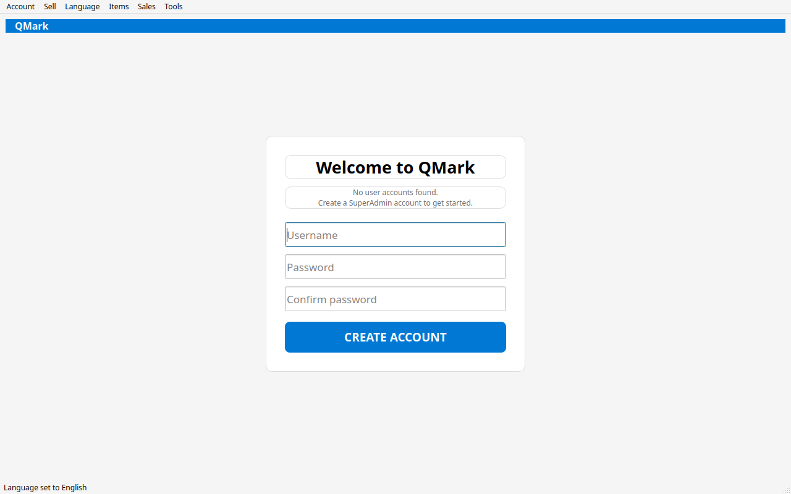

*Figure 2‑1: The first‑run wizard — create the first SuperAdmin account.*

### 2.2 Where is the data stored?

On first launch QMark creates its database files in the folder where the program runs:

| File | Contents |
|---|---|
| `items.db` | Items, sales, categories, shelves, daily statistics |
| `users.db` | User accounts and password hashes |

Both files are plain **SQLite** databases. The exact paths can be changed later on the **Database Selection** page (Chapter 12). Make sure these files are **backed up** regularly — they are your entire shop's data (see Chapter 14, Backups).

### 2.3 Defaults

- **Language:** Polish (changeable in **Language** menu or **Ustawienia** / Preferences).
- **Currency:** PLN (zł) — prices are shown with a comma decimal, e.g. `3,50 zł`. A SuperAdmin can switch to USD and convert prices (Chapter 11).

---

## Chapter 3 — The Interface and Menus

### 3.1 Dashboard

After logging in as Admin/SuperAdmin you land on the **Dashboard**, showing at a glance:

- **Total Items** — how many products are in the catalogue,
- **Items Sold** — total units sold,
- **Revenue** — total turnover,
- **Recent Sales** — the last 10 transactions,
- a live clock/date and a calendar.

The big **SELL** button jumps straight to the Sell (POS) page.
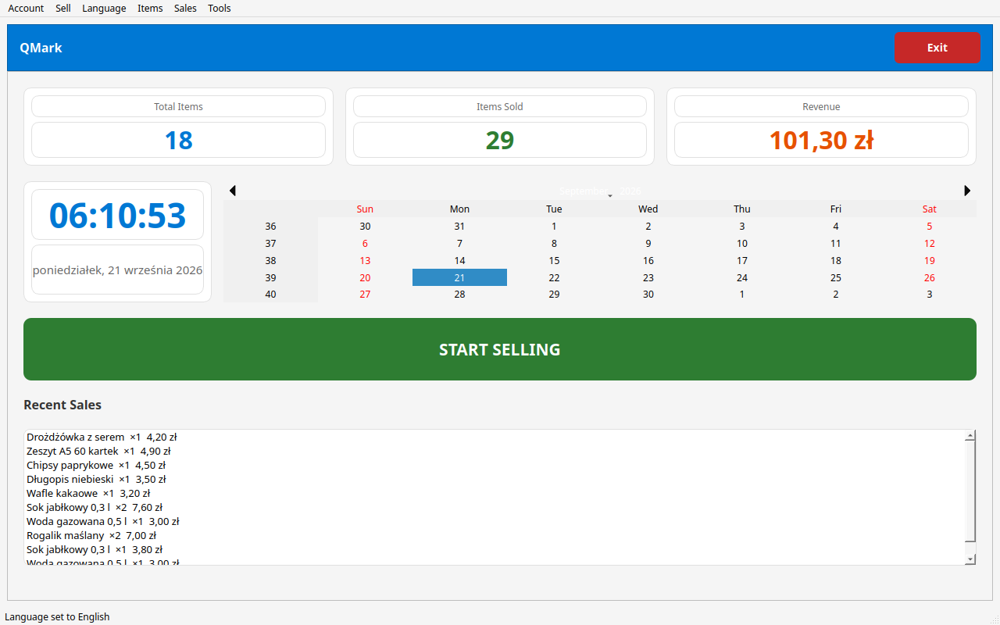

*Figure 3‑1: The Dashboard — totals, calendar and recent sales.*

### 3.2 Menu map

| Menu | Items | Typical use |
|---|---|---|
| **Account** | Log In, Log Out, Register User, Exit | Session, creating user accounts (🔒) |
| **Items** | Resupply, Add/Edit/Remove Item, Undo Removed Items, Manage Categories, Manage Shelves | Inventory |
| **Sell** | Sell Item (POS) | The till |
| **Language** | English, Polski | Interface language |
| **Sales** | Sales History, Sales Report | Reporting |
| **Tools** | Database Selection, Create Database, Accounts, Preferences, Worklog Statistics, Troubleshoot, Automation & Remote | Administration (🔒 for DB/Accounts/Automation) |

> **Language switching** is instant and available to all roles — clerks may also switch languages on their own machine if the administrators allow it.

---

## Chapter 4 — Managing User Accounts 🔒

User accounts live in `users.db`. Only a SuperAdmin can create accounts or change roles and passwords.

### 4.1 Creating a user account

**Two ways to reach the register form:**

- **Account → Register User**, or
- **Tools → Accounts** and use the link/button on that page.

Fill in:

1. **Username** — unique name for the account.
2. **Password** and **Confirm password** — they must match. As you type, a **password strength meter** shows: Weak, Medium, Strong, Very strong (based on length, upper/lower case, digits and symbols).
3. **Role** — choose one of: **Clerk**, **Admin**, **SuperAdmin**.
4. Click the register button.

> **Password minimums.** The strength meter guides you, but QMark itself does not enforce a fixed minimum on this screen — follow good practice and require at least 8 characters with mixed case and digits.
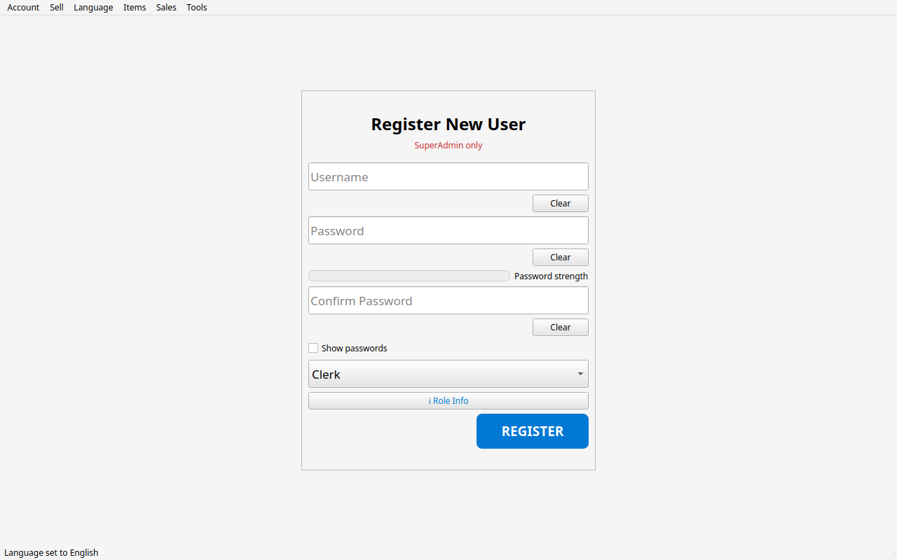

*Figure 4‑1: The Register New User form (SuperAdmin‑only).*

### 4.2 Viewing accounts and changing roles

1. Open **Tools → Accounts**.
2. The list shows every account as `username | role`, e.g. `anna | Clerk`.
3. Click an account to select it.
4. **Change Role** — pick **Clerk**, **Admin**, or **SuperAdmin** from the dialog. The new role applies immediately (and takes full effect the next time that user logs in or on their current session menus).
5. **Search Account** — re‑loads the list (also filters by the search box if you typed a name).

> **Least privilege.** Give users the *lowest* role they need: Clerks for till work, Admin for stock/reports, SuperAdmin only to the people who really run the system. Fewer SuperAdmins = fewer risks.
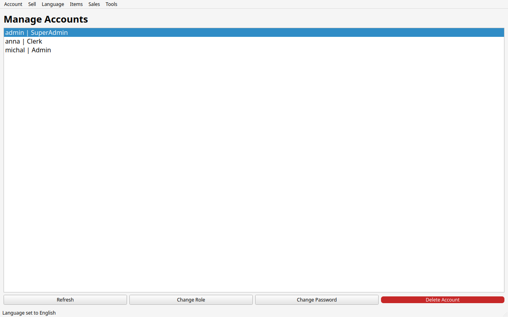

*Figure 4‑2: The Accounts page — every user listed as `username | role`.*

### 4.3 Changing a password

1. Select the account in **Tools → Accounts**.
2. Click **Change Password**.
3. Enter the new password.

QMark hashes the password (Argon2id with a per‑user salt) before storing it — plaintext passwords are never saved. A user who forgot their password cannot recover it; a SuperAdmin simply assigns a new one.

### 4.4 Deleting accounts

⚠️ **Note:** account deletion is **not implemented** in the current version. The **Delete Account** button shows *"Account deletion not yet implemented."* Instead, you can:

- leave the account unused, or
- change the user's password so only you can use it.

---

## Chapter 5 — Managing Items

### 5.1 Adding an item

**Items → Add Item** opens the form:

| Field | Notes |
|---|---|
| **Item Name** | Required. |
| **Quantity** | Required, whole number. |
| **Price** | Required. Unit price in the current currency. |
| **Category** | Optional group (see Chapter 6). |
| **Shelf / Location** | Optional physical location, e.g. `A1`. |
| **Status** | In Stock / Low Stock / Out of Stock / Sold Out (you can also let QMark manage it automatically — see Resupply). |
| **ID** | Optional. Tick **Auto‑generate ID** to create one automatically, or enter your own ID and press **Check ID** to verify it is not already in use. |

Click the **Add Item** button; a confirmation appears and the form clears for the next product.
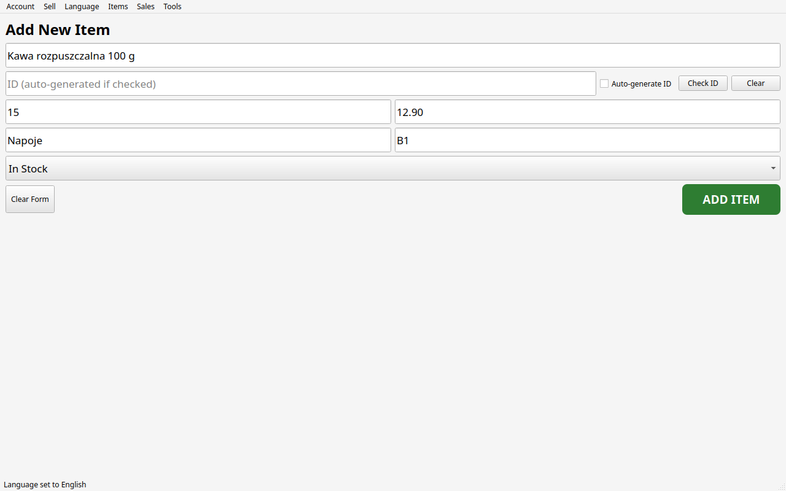

*Figure 5‑1: Adding an item — name, quantity, price, category and shelf.*

### 5.2 Editing an item

1. **Items → Edit Item** — the page opens with all items listed.
2. Use the search box (search by name, ID, category, shelf or status via the field dropdown) or scroll the list.
3. Click an item — its data fills the form.
4. Change whatever you need (name, quantity, price, category, shelf, status).
5. Click **Edit Item**.

The change is saved immediately and recorded in the worklog.
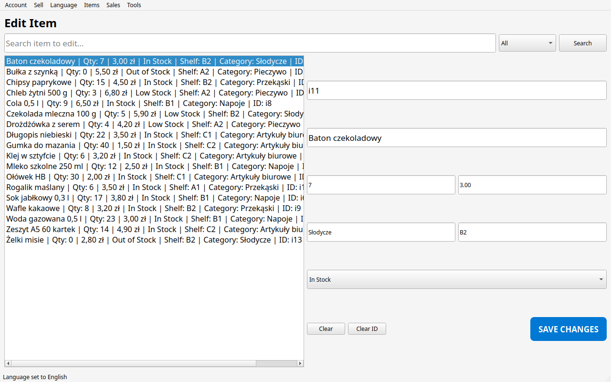

*Figure 5‑2: Editing an item — pick it from the list, then edit the form.*

### 5.3 Removing an item (soft delete)

1. **Items → Remove Item**.
2. Find the item (search box) and click it to select.
3. Click **Remove Item** and confirm.

**Important:** removal is *soft*. The item is not destroyed — it is moved to a "removed" area so it can be restored:

- **Items → Undo Removed Items** shows all removed products.
  - **Undo Selected** restores the highlighted one.
  - **Undo All** restores everything.
  - The **Undo Last** button on the Remove page restores the most recently removed item.
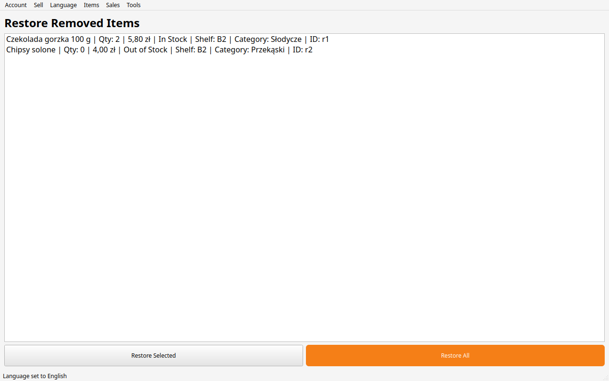

*Figure 5‑3: Undo removed items — restore soft‑deleted products.*

> Removing an item does **not** remove its past sales from the history — reports and the sales log keep the records.
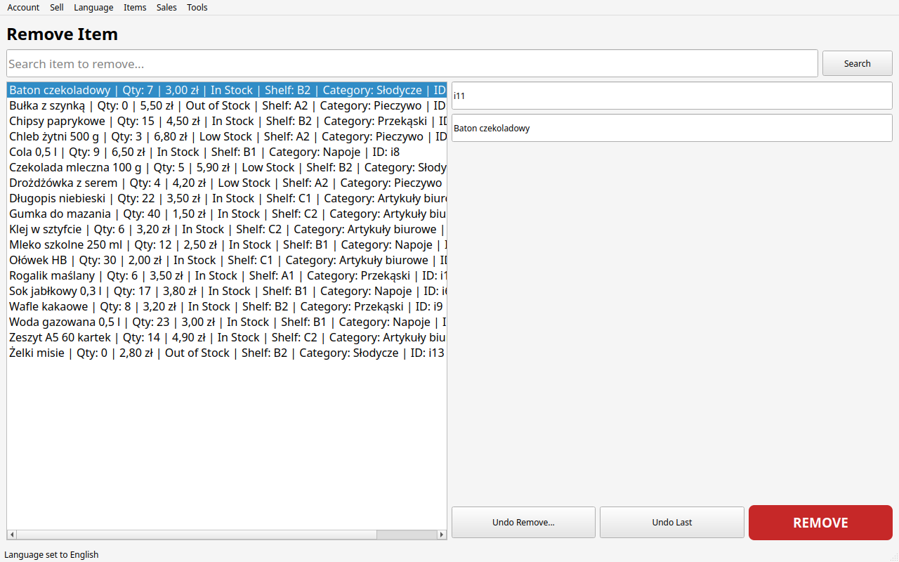

*Figure 5‑4: Removing an item — select it from the filtered list and confirm.*

### 5.4 Item statuses

QMark uses four automatic/selectable statuses:

| Status | Meaning | Auto‑set when quantity is… |
|---|---|---|
| In Stock | Normal availability | > 5 |
| Low Stock | Running out (shown orange) | 1 – 5 |
| Out of Stock | Quantity is 0 (shown red) | 0 |
| Sold Out | Deliberately taken off sale (red) | manual |

Statuses also update when you sell or undo sales, and when you change stock via Resupply.
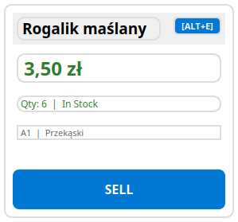 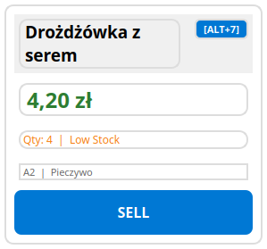 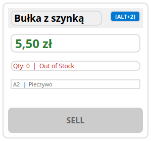

*Figure 5‑5: The three card states in the POS grid.*

---

## Chapter 6 — Categories and Shelves

### 6.1 Categories

**Items → Manage Categories** — use to organise items into groups (Snacks, Drinks, Stationery…).

- **Add** — type the category name and press **Add**.
- Select a category in the list → **Edit** renames it.
- Select → **Remove** deletes the category (with confirmation).
- The **Undo Add / Undo Edit / Undo Remove** buttons simply refresh the list.

> Categories are free text you type into the Add/Edit Item forms — creating the category here is convenient but not required.
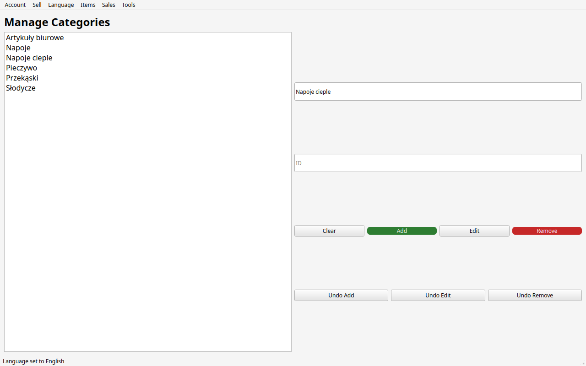

*Figure 6‑1: Managing categories.*

### 6.2 Shelves

**Items → Manage Shelves** works exactly like categories, but for physical locations (`A1`, `B2`, `C3`…). Keeping shelves tidy helps staff find products and keeps the layout readable on the POS cards.
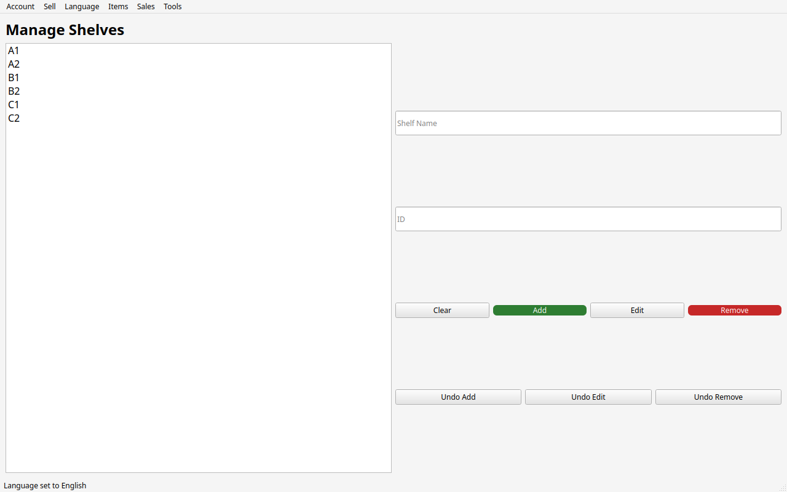

*Figure 6‑2: Managing shelves.*

---

## Chapter 7 — Resupply (Adjusting Stock)

**Items → Resupply** is the fastest way to fix stock levels:

1. Search for an item (results filter as you type).
2. Click the item — its card shows name, category, shelf, price and current quantity.
3. Adjust the quantity using:
   - the big **−10 −5 −1 +1 +5 +10** buttons (saved immediately), or
   - the number box + **APPLY** button (sets the exact value).
4. The status label confirms each change, e.g. *"Quantity updated to 12!"*

QMark updates the item's status automatically: `0 → Out of Stock`, `≤ 5 → Low Stock`, otherwise **In Stock**. Every adjustment is recorded in the worklog.

> Resupply is useful after a delivery arrives, or when you notice the stock on the POS page is wrong.
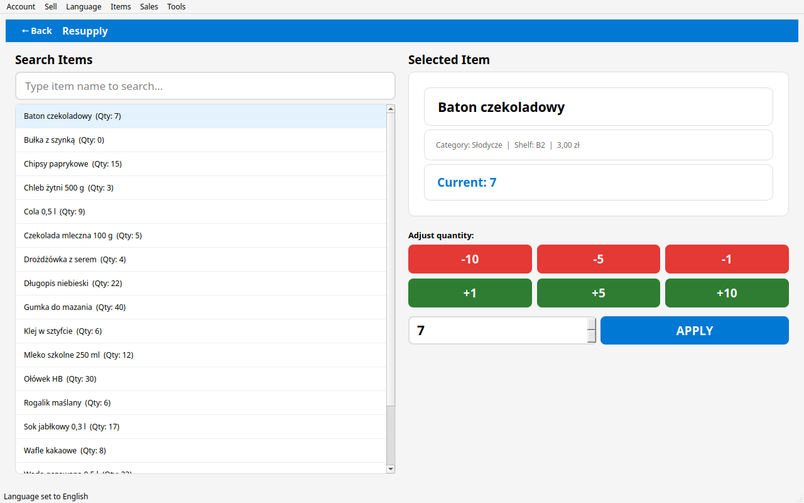

*Figure 7‑1: Resupply — select an item and adjust its quantity with −/+ buttons or an exact value.*

---

## Chapter 8 — Sales History

**Sales → Sales History** gives you the complete transaction log.

- **Refresh** reloads all sales; **Total Revenue** at the top shows the sum.
- **Search** filters the list (e.g. by item name or sale ID); the label switches to **Search Total** for the filtered sum.
- **Simple view** toggles between a compact one‑line format and the detailed format.
- **Export** saves the whole sales list as a **CSV** file (`sales_export.csv`, choose location) with columns:
  `Sale ID, Item ID, Quantity Sold, Unit Price, Total Amount, Sold By, Sale Date`.

> The CSV opens directly in spreadsheet programs (Excel, LibreOffice Calc) — handy for end‑of‑day summaries or external accounting.
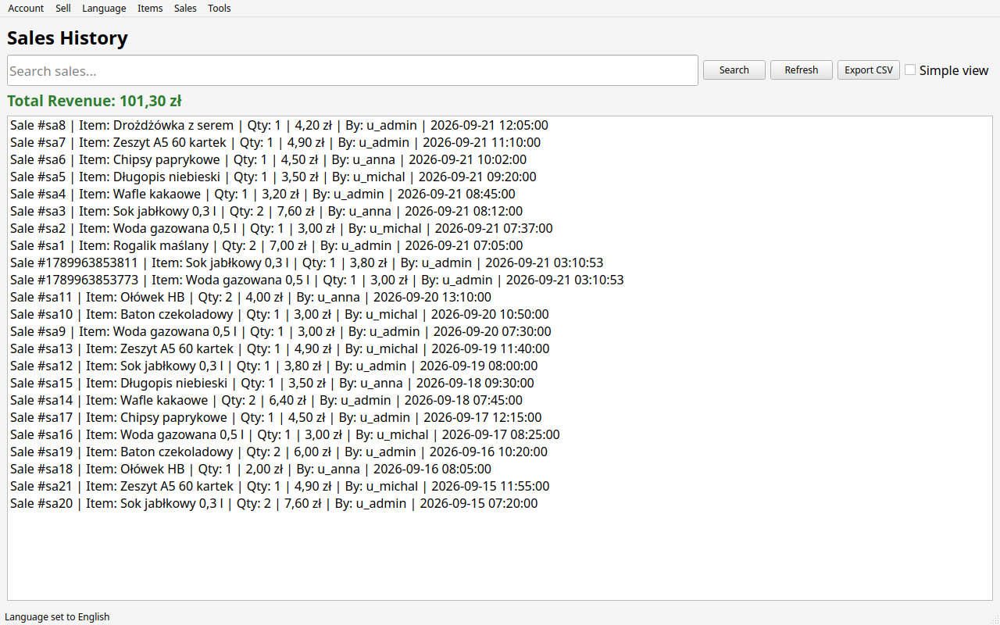

*Figure 8‑1: The complete sales history with total revenue, search and CSV export.*

---

## Chapter 9 — Sales Reports 📊

**Sales → Sales Report** generates a full report for the current data:

### 9.1 What the report contains

- Totals: revenue, transactions, items sold.
- Stock overview: items in stock, low‑stock count, out‑of‑stock count.
- **Today's statistics**: sales, revenue, items sold, top seller, top item, busiest hour.
- **Trends**: revenue for the last 7 days, trend vs. yesterday.
- **Top selling items** (top 5) and **top sellers** (top 3).
- The list of low‑stock items that need replenishing.

Two charts are drawn automatically:

- **Pie chart** — top selling items (top 8 + "Other").
- **Bar chart** — shop activity by hour of day.

### 9.2 Generating and exporting

1. Click **Generate Report** — text and charts appear.
2. **Export** saves the text as `.txt`.
3. **Export PDF** saves a complete PDF document containing the text **and** the charts. The suggested file name contains a timestamp (`QMark_Report_2026-09-21_141530.pdf`) so exports never silently overwrite each other.
4. **Exit Report** returns to the Dashboard.

> Statistics are computed from the database (with a GUI‑independent engine), so numbers are correct even if the till was switched off during breaks.
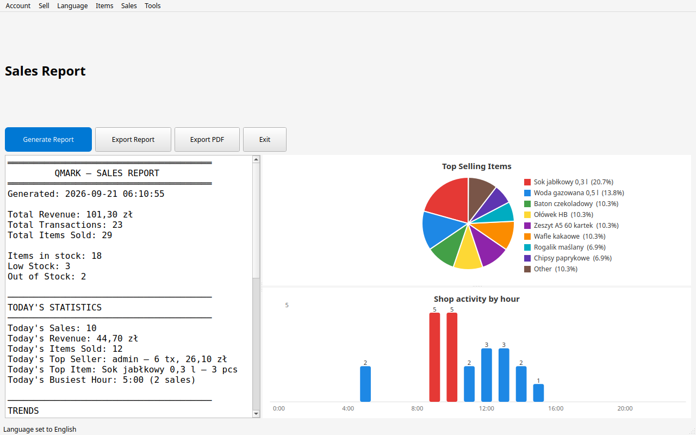

*Figure 9‑1: A generated sales report with pie and bar charts.*

---

## Chapter 10 — Worklog

The worklog records **what happened during a session** — every add, edit, remove, sale, category and shelf change, together with the operating user.

### 10.1 Enabling the worklog

**Tools → Preferences** (Ustawienia) → tick **Worklog** and save. Once enabled, QMark writes per‑session log files to a `worklogs/` folder next to the program.

### 10.2 Viewing statistics

**Tools → Worklog Statistics** shows the current session's counts:

```
Items Added / Edited / Removed
Sales Recorded
Categories Added / Edited / Removed
Shelves Added / Edited / Removed
Users Added / Edited / Removed
```

**Export** saves the statistics as a text file.
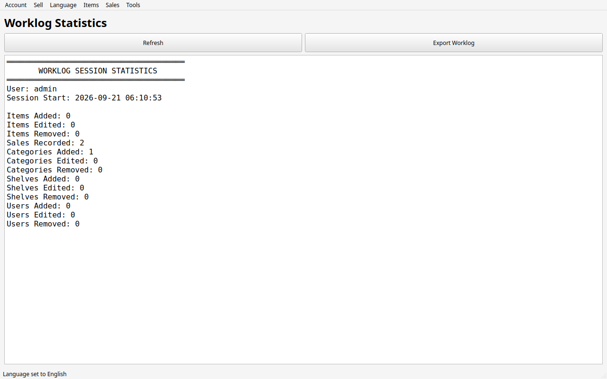

*Figure 10‑1: Worklog statistics for the current session.*

---

## Chapter 11 — Preferences 🔒 / ⚙️

**Tools → Preferences** (Ustawienia). Available to all logged‑in users, but some controls are SuperAdmin‑only.

| Setting | Who | Notes |
|---|---|---|
| **Language** | all | English or Polski. |
| **Currency** | 🔒 SuperAdmin | **PLN (zł)** or **USD ($)**. ⚠️ Switching currency does **not** convert existing prices. |
| **Convert All Prices** | 🔒 SuperAdmin | Multiplies every stored price by a factor you enter (`new price = old price × factor`), e.g. `0.25` to go from złoty to dollars. |
| **Enable sell keybinds** | all | The Alt+keys shortcuts on the Sell page. |
| **Worklog** | all* | Turns per‑session worklog recording on/off. |
| **Telemetry** | 🔒 | See Chapter 12.4. |
| **Reset Preferences** | all* | Restores defaults (language = Polish, currency = PLN, keybinds = on, worklog/telemetry = off). Database paths are kept. |

> **Currency change is cosmetic until you convert.** If you switch from PLN to USD, the symbol changes but the numbers stay the same — use **Convert All Prices** to actually scale the prices, then adjust any irregular items by hand.
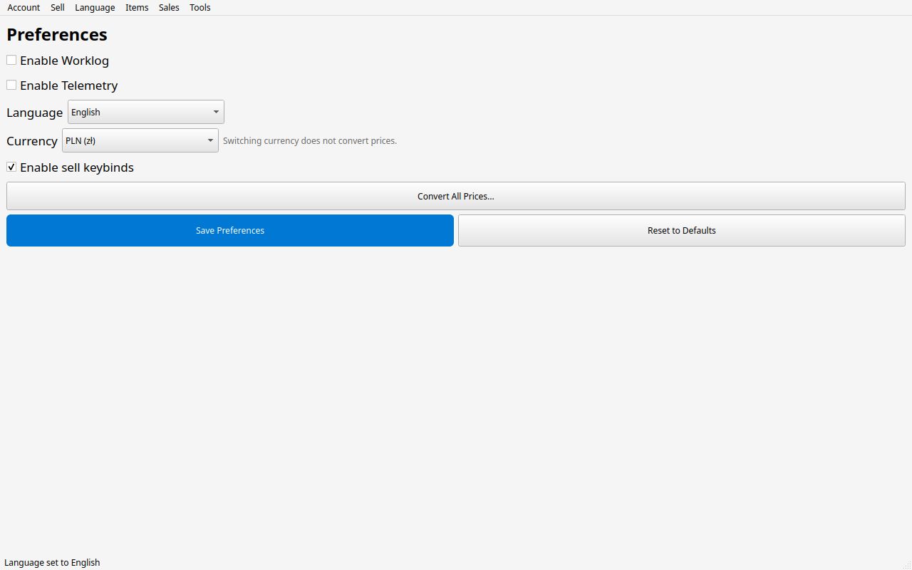

*Figure 11‑1: Preferences — language, currency and toggles.*

---

## Chapter 12 — Database Management 🔒

### 12.1 Database Selection

**Tools → Database Selection** (also **Create Database** leads here).

- **Items database** — path to `items.db`.
- **Users database** — path to `users.db`.
- **Browse** — pick an existing `.db` file (or type a path).
- **Load DB Config** — connects to the given files.
- **Save as Default** — remembers the paths for future launches.
- **Test Connection** — verifies the program can actually reach the databases.
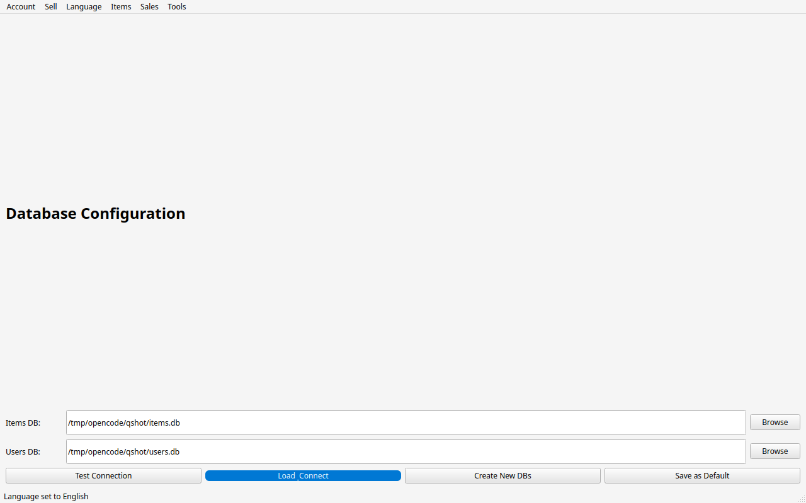

*Figure 12‑1: Database Selection — which `items.db` / `users.db` QMark uses.*

### 12.2 Creating a new database

**Create New DB** initialises fresh SQLite databases at the given paths.

⚠️ **This replaces whatever is at those paths.** Use it only to start a brand‑new shop, or point it at new file names — never point it at your live `items.db`/`users.db` unless you are sure.

### 12.3 Configuration storage

Apart from the two databases, QMark remembers settings (language, currency, database paths, toggles) in the standard per‑user configuration store of the operating system (`QMark/SchoolShop`).

### 12.4 Telemetry 🔒

The **Telemetry** toggle (on the Database Selection page) enables a dual logging sink:

- a human‑readable `.log` file, and
- a SQLite `.db` with the same events,

stored in a `telemetry/` folder next to the program (files named `telemetry_<timestamp>.log` / `.db`). It records events for diagnostics — it is *local*, opt‑in, and can be turned off at any time.

> **Privacy note:** telemetry stays on the machine. If your school has data‑protection rules, keep telemetry off unless you need it for troubleshooting — and delete the `telemetry/` folder when you no longer need the logs.

---

## Chapter 13 — Troubleshooting & Diagnostics

**Tools → Troubleshoot** gives you three tools:

| Button | What it does |
|---|---|
| **Test DB Connection** | Verifies the databases are reachable. |
| **View Logs** | Tells you where the program's log files are stored (the folder the program runs from). |
| **Export Diagnostics** | Saves a timestamped diagnostics file (`diagnostics_<timestamp>.txt`) with: date, DB connected, logged in, user, role, telemetry on/off, worklog on/off, currency, language. |

**Best practice:** before contacting support or reporting a bug, export the diagnostics and the relevant log/telemetry files — they contain most of the information needed to diagnose the problem.
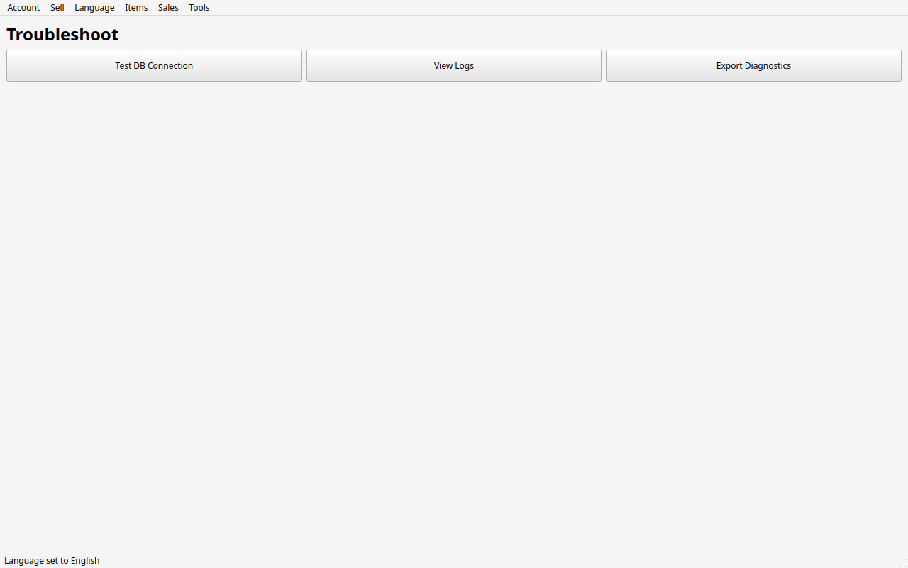

*Figure 13‑1: Troubleshoot & Diagnostics.*

---

## Chapter 14 — Automation & Remote 🔒

**Tools → Automation & Remote** is the SuperAdmin control room. All settings here are saved with **Save Automation Settings** (several sections also save automatically when you change them). The scheduler checks every 30 seconds and runs tasks when their configured time arrives, so the program must be running at the scheduled time.
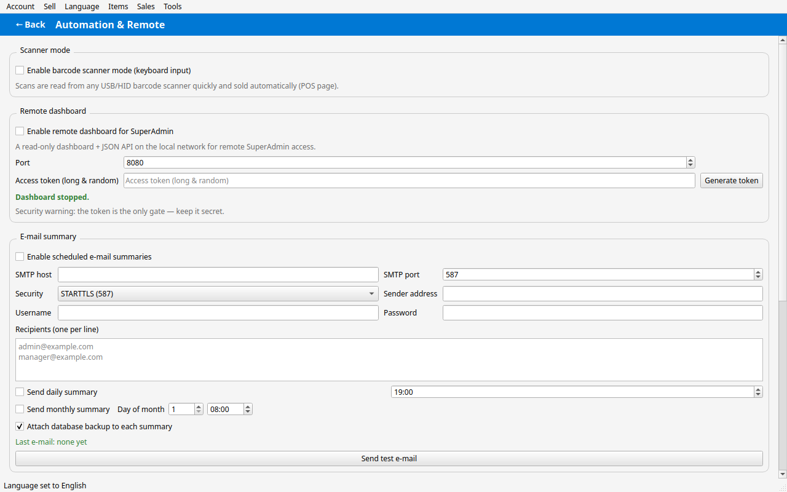

*Figure 14‑1: Automation & Remote — all scheduled services under one roof.*

### 14.1 Scanner mode

**Enable barcode scanner mode** — turns on automatic selling from USB/HID barcode scanners on the POS page (see the User Guide). Toggle it here once; scanners then work for every logged‑in clerk.

### 14.2 Remote dashboard

**Enable remote dashboard** serves a read‑only dashboard + JSON API on your *local network* so you can check the shop remotely.

1. Tick **Enable remote dashboard for SuperAdmin**.
2. Set the **Port** (default 8080).
3. Set an **Access token** — at least 16 characters. Use **Generate token** to create a long, random one.
4. Save. The status label shows the state and the **Dashboard URL**, typically:

   ```
   http://<computer-name>:8080/?token=<your-token>
   ```

Open that URL from another device on the same network and log in with the token.

> 🔐 **Security warning:** the token is the *only* gate between the network and your data. Never share it, never use a short one, and only enable the dashboard on a trusted network (school LAN). The program refuses to start the dashboard with a token shorter than 16 characters.

### 14.3 E‑mail summaries

QMark can e‑mail shop summaries on a schedule:

1. **Enable scheduled e-mail summaries**.
2. **SMTP settings**: host (e.g. `smtp.example.com`), port, security mode — `STARTTLS (587)`, `Implicit TLS (465)` or `Plaintext (25)`; sender address, username, password.
3. **Recipients** — one e‑mail address per line.
4. Schedule:
   - **Send daily summary** at a chosen time (HH:mm).
   - **Send monthly summary** on a chosen day of the month (1–28) at a chosen time.
5. Optional: **Attach database backup to each summary** (a ZIP of the databases).
6. Click **Send test e‑mail** to verify the configuration.

The summary contains the same key numbers as the report (revenue, transactions, items sold, top item, trend).

### 14.4 Backups

Local backups are ZIP bundles of the databases.

- **Backup folder** — where backup archives are written.
- **Keep last N backups** — how many old archives to retain (default 10); older ones are pruned automatically.
- **Scheduled backup** — run daily at a chosen time.
- **Online copy via e‑mail** — send a copy to the recipients configured in 14.3.
- **Upload a copy to a custom server (HTTP PUT)** — with the server URL (you may use a `{filename}` placeholder in the URL) and an optional **Bearer token**.
- **Back up now** — run a backup immediately, right from the page.

> **Backups are your safety net.** Schedule one daily, keep at least a week's worth, and store at least one copy somewhere that is not the same computer (e‑mail or HTTP upload).

### 14.5 Auto‑update

- **Enable automatic update checks from GitHub** — QMark checks for new releases on startup.
- **Check for updates now** — manual check. If a newer version exists, QMark asks whether to download and apply it; after applying it restarts itself automatically.

> Keep QMark updated — every release also contains fixes and improvements.

---

## Chapter 15 — Security Best Practices 🔒

1. **One SuperAdmin, and only one or two.** Everything else should be Admin or Clerk.
2. **Use strong passwords.** At least 8 characters, mixed case, digits and symbols. QMark stores passwords as **Argon2id hashes with per‑user salts** — even so, weak passwords are weak.
3. **The remote token is a password too.** Long, random, kept secret, regenerated after any suspicion.
4. **Back up regularly** (14.4) and test that a backup can be restored.
5. **Know your data.** The two databases (`items.db`, `users.db`) are the whole shop. The optional telemetry folder contains diagnostic logs; delete it when no longer needed.
6. **Keep the program updated** (14.5).
7. **Log out of unattended machines**, and make sure clerks log out at the end of shifts — every sale is attributed to the logged‑in user in reports and worklogs.

---

## Chapter 16 — FAQ

**Q: I forgot the SuperAdmin password.**
A: There is no recovery mechanism by design. Restore a backup of `users.db`, or (as a last resort) create a fresh installation and register a new SuperAdmin.

**Q: Can I delete a user account?**
A: Not in the current version — the button is a placeholder. Change the user's password instead.

**Q: The currency symbol changed but prices look wrong.**
A: Changing currency does not convert prices. Use **Convert All Prices** with the correct factor and then fix edge cases by hand.

**Q: The dashboard won't start.**
A: The access token must be at least 16 characters. Generate a new token, save, and check the status label; also make sure the port is free.

**Q: E‑mail summaries don't arrive.**
A: Test with **Send test e‑mail** first. Check SMTP host/port/security matching your provider, the sender address, and that the program is running at the scheduled time (the scheduler needs the till running to send).

**Q: Where does QMark store data?**
A: In `items.db` and `users.db` (paths shown on Database Selection), plus optional `worklogs/` and `telemetry/` folders, next to the program.

**Q: Can clerks change stock or prices?**
A: No — that is Admin/SuperAdmin work (Items and Resupply). Clerks only sell, view the sales log and undo sales.

---

## Appendix — Menu Quick Reference

| Path | Feature | Role |
|---|---|---|
| Account → Register User | Create a user account | 🔒 SuperAdmin |
| Items → Resupply | Adjust stock fast | Admin+ |
| Items → Add/Edit/Remove Item | Inventory | Admin+ |
| Items → Undo Removed Items | Restore soft‑deleted items | Admin+ |
| Items → Manage Categories / Shelves | Organise the shop | Admin+ |
| Sell → Sell Item (POS) | The till | all |
| Sales → Sales History | Transaction log + CSV | Admin+ |
| Sales → Sales Report | Text + charts, TXT/PDF export | Admin+ |
| Tools → Database Selection / Create Database | DB paths, create, telemetry | 🔒 SuperAdmin |
| Tools → Accounts | Roles and passwords | 🔒 SuperAdmin |
| Tools → Preferences | Language, currency, toggles | all (currency 🔒) |
| Tools → Worklog Statistics | Session stats | Admin+ |
| Tools → Troubleshoot | Diagnostics | Admin+ |
| Tools → Automation & Remote | Scanner, dashboard, e‑mail, backups, updates | 🔒 SuperAdmin |

---

*Thank you for using QMark!*