# O tym podręczniku

Ten podręcznik jest przeznaczony dla osoby, która **zarządza instalacją QMark**: konfiguracją, kontami użytkowników, przedmiotami i zapasami, raportami oraz automatyzacją (skaner, podsumowania e-mail, kopie zapasowe, aktualizacje).

**SuperAdmin** może robić wszystko to, co **Administrator (Admin)**, a dodatkowo zarządzać kontami użytkowników, rolami, hasłami, walutą, bazami danych i funkcjami automatyzacji. Ten podręcznik obejmuje więc *wszystkie* te obszary. Jeśli jesteś Adminem (nie SuperAdminem), większość treści również dotyczy Ciebie — sekcje oznaczone 🔒 są dostępne wyłącznie dla SuperAdmina.

> **Jak czytać oznaczenia.** Sekcje, których może używać tylko SuperAdmin, są oznaczone 🔒. Wszystko pozostałe jest dostępne dla Admina i SuperAdmina.

---

## Rozdział 1 — Role w skrócie

| Możliwość | Sprzedawca | Admin | SuperAdmin |
|---|:---:|:---:|:---:|
| Sprzedaż, dziennik sprzedaży, cofanie sprzedaży | ✅ | ✅ | ✅ |
| Dodawanie / edycja / usuwanie przedmiotów | | ✅ | ✅ |
| Przywracanie usuniętych przedmiotów | | ✅ | ✅ |
| Zarządzanie kategoriami i półkami | | ✅ | ✅ |
| Dostawa (uzupełnianie zapasów) | | ✅ | ✅ |
| Historia sprzedaży, eksport CSV | | ✅ | ✅ |
| Raporty sprzedaży (tekst + wykresy, eksport TXT/PDF) | | ✅ | ✅ |
| Statystyki dziennika, strona Rozwiązywanie problemów | | ✅ | ✅ |
| Nadawanie ról i zmiana haseł | | | 🔒 |
| Rejestracja nowych użytkowników | | | 🔒 |
| Zmiana waluty, przeliczanie wszystkich cen | | | 🔒 |
| Wybór bazy danych, tworzenie baz | | | 🔒 |
| Automatyzacja i zdalny dostęp (skaner, e-mail, kopie, aktualizacje) | | | 🔒 |

- **Sprzedawca** widzi tylko stronę Sprzedaż, menu **Język** i okrojone menu **Konto**.
- **Admin** po zalogowaniu trafia na **Pulpit** i ma dostęp do menu **Przedmioty**, **Raporty** oraz większości menu **Narzędzia**.
- **SuperAdmin** dodatkowo widzi **Wybór bazy danych**, **Utwórz bazę danych**, **Konta**, **Ustawienia** (waluta) oraz **Automatyzację i zdalny dostęp**.

---

## Rozdział 2 — Konfiguracja początkowa

### 2.1 Co dzieje się przy pierwszym uruchomieniu

Przy pierwszym uruchomieniu QMark wykrywa, że **nie istnieje żaden użytkownik**, i wyświetla kreator konfiguracji: **„Welcome to QMark — No user accounts found. Create a SuperAdmin account to get started.”** (Brak kont użytkowników. Utwórz konto SuperAdmina, aby rozpocząć.)

Wypełnij formularz:

1. **Nazwa użytkownika** — podaj nazwę konta SuperAdmina (np. `admin`).
2. **Hasło** — podaj hasło (co najmniej 4 znaki).
3. **Potwierdź hasło** — powtórz hasło.
4. Kliknij **CREATE ACCOUNT** (Utwórz konto).

QMark tworzy konto i przenosi Cię na ekran logowania. Zaloguj się przy użyciu nowych danych.

> **Chroń to konto** — to klucz główny systemu. Do rozpoczęcia pracy wystarczy jeden użytkownik; kolejne konta dodasz w **Narzędzia → Konta** (rozdział 4).
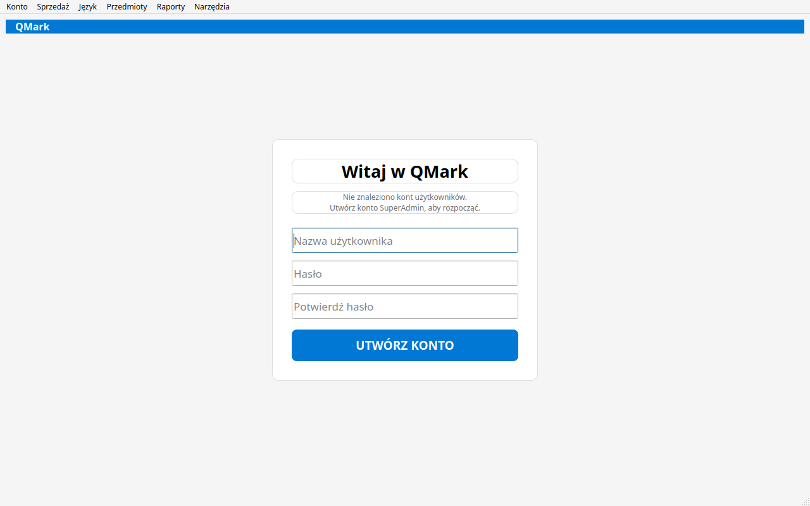

*Rysunek 2‑1: Kreator pierwszego uruchomienia — utwórz pierwsze konto SuperAdmina.*

### 2.2 Gdzie przechowywane są dane?

Przy pierwszym uruchomieniu QMark tworzy pliki bazy danych w folderze, w którym uruchomiony jest program:

| Plik | Zawartość |
|---|---|
| `items.db` | Przedmioty, sprzedaże, kategorie, półki, statystyki dzienne |
| `users.db` | Konta użytkowników i hasła (skróty) |

Oba pliki to zwykłe bazy **SQLite**. Dokładne ścieżki można zmienić na stronie **Wybór bazy danych** (rozdział 12). Regularnie twórz **kopie zapasowe** tych plików — to wszystkie dane Twojego sklepiku (patrz rozdział 14, Kopie zapasowe).

### 2.3 Wartości domyślne

- **Język:** polski (zmiana w menu **Język** lub w **Ustawieniach**).
- **Waluta:** PLN (zł) — ceny są pokazywane z przecinkiem, np. `3,50 zł`. SuperAdmin może przełączyć na USD i przeliczyć ceny (rozdział 11).

---

## Rozdział 3 — Interfejs i menu

### 3.1 Pulpit (Dashboard)

Po zalogowaniu jako Admin/SuperAdmin trafiasz na **Pulpit**, który pokazuje na pierwszy rzut oka:

- **Liczba przedmiotów** — ile produktów jest w katalogu,
- **Sprzedano sztuk** — łączna liczba sprzedanych sztuk,
- **Przychód** — łączny obrót,
- **Ostatnie sprzedaże** — ostatnie 10 transakcji,
- aktualny zegar/data oraz kalendarz.

Duży przycisk **SPRZEDAJ** przenosi od razu na stronę Sprzedaż (POS).
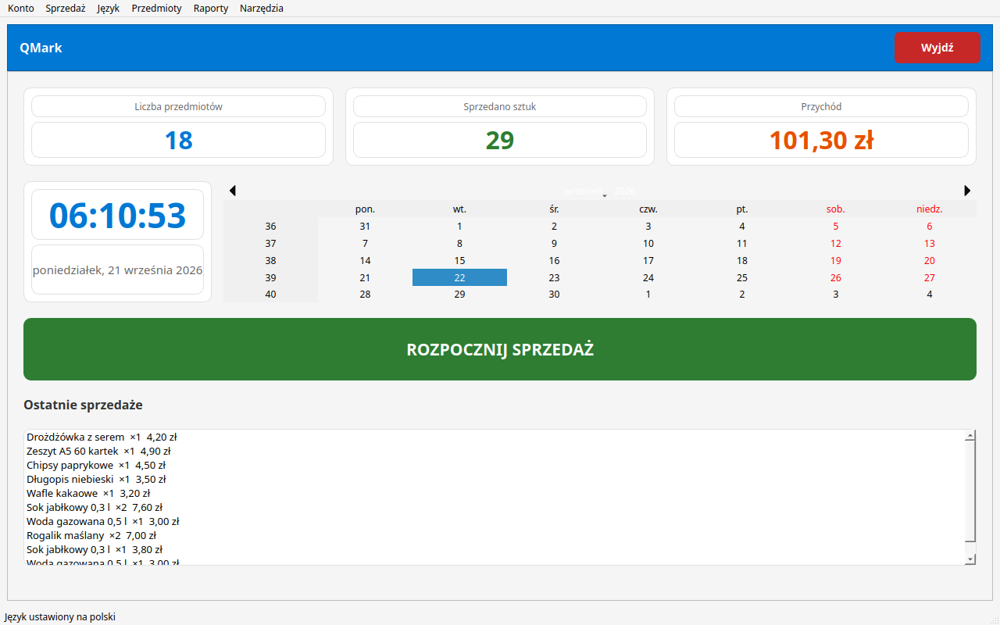

*Rysunek 3‑1: Pulpit — podsumowania, kalendarz i ostatnie sprzedaże.*

### 3.2 Mapa menu

| Menu | Pozycje | Zastosowanie |
|---|---|---|
| **Konto** | Zaloguj się, Wyloguj się, Zarejestruj użytkownika, Wyjdź | Sesja, tworzenie kont (🔒) |
| **Przedmioty** | Dostawa, Dodaj/Edytuj/Usuń przedmiot, Cofnij usunięte przedmioty, Zarządzaj kategoriami, Zarządzaj półkami | Magazyn |
| **Sprzedaż** | Sprzedaj przedmiot (POS) | Kasa |
| **Język** | English, Polski | Język interfejsu |
| **Raporty** | Historia sprzedaży, Raport sprzedaży | Raportowanie |
| **Narzędzia** | Wybór bazy danych, Utwórz bazę danych, Konta, Ustawienia, Statystyki dziennika, Rozwiązywanie problemów, Automatyzacja i zdalny dostęp | Administracja (🔒 dla baz/kont/automatyzacji) |

> **Zmiana języka** jest natychmiastowa i dostępna dla wszystkich ról — sprzedawcy również mogą przełączyć język na swoim stanowisku, jeśli na to pozwolisz.

---

## Rozdział 4 — Zarządzanie kontami użytkowników 🔒

Konta użytkowników znajdują się w `users.db`. Tylko SuperAdmin może tworzyć konta oraz zmieniać role i hasła.

### 4.1 Tworzenie konta użytkownika

**Dwie drogi do formularza rejestracji:**

- **Konto → Zarejestruj użytkownika**, albo
- **Narzędzia → Konta** i przycisk na tej stronie.

Wypełnij:

1. **Nazwa użytkownika** — unikalna nazwa konta.
2. **Hasło** i **Potwierdź hasło** — muszą się zgadzać. Podczas pisania **wskaźnik siły hasła** pokazuje: Słabe, Średnie, Silne, Bardzo silne (na podstawie długości, wielkich/małych liter, cyfr i znaków specjalnych).
3. **Rola** — wybierz jedną z: **Sprzedawca (Clerk)**, **Administrator (Admin)**, **SuperAdmin**.
4. Kliknij przycisk rejestracji.

> **Minimalna długość hasła.** Wskaźnik siły tylko podpowiada — QMark nie wymusza tu sztywnego minimum. Kieruj się dobrą praktyką: co najmniej 8 znaków, mieszane wielkie i małe litery, cyfry oraz znaki specjalne.
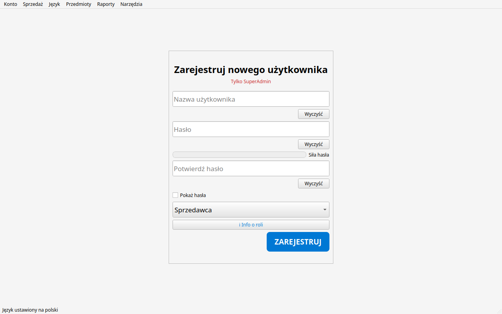

*Rysunek 4‑1: Formularz rejestracji nowego użytkownika (tylko SuperAdmin).*

### 4.2 Przeglądanie kont i zmiana ról

1. Otwórz **Narzędzia → Konta**.
2. Lista pokazuje każde konto jako `nazwa | rola`, np. `anna | Sprzedawca`.
3. Kliknij konto, aby je zaznaczyć.
4. **Zmień rolę** — wybierz **Sprzedawca**, **Admin** lub **SuperAdmin** w oknie dialogowym. Nowa rola obowiązuje natychmiast (w pełnym zakresie po ponownym zalogowaniu użytkownika).
5. **Szukaj konta** — przeładowuje listę (i filtruje według wpisanego tekstu).

> **Zasada najmniejszych uprawnień.** Nadawaj użytkownikom *najniższą* rolę, której potrzebują: Sprzedawca do pracy przy kasie, Admin do magazynu/raportów, SuperAdmin tylko osobom faktycznie zarządzającym systemem. Mniej SuperAdminów = mniejsze ryzyko.
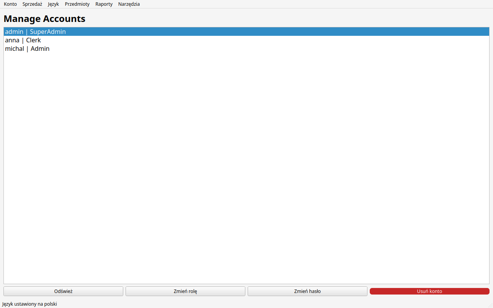

*Rysunek 4‑2: Strona Konta — każdy użytkownik jako `nazwa | rola`.*

### 4.3 Zmiana hasła

1. Zaznacz konto w **Narzędzia → Konta**.
2. Kliknij **Zmień hasło**.
3. Wpisz nowe hasło.

QMark haszuje hasło (Argon2id z indywidualną solą) przed zapisaniem — hasła nigdy nie są przechowywane jawnie. Użytkownik, który zapomniał hasła, nie może go odzyskać; SuperAdmin po prostu nadaje mu nowe.

### 4.4 Usuwanie kont

⚠️ **Uwaga:** usuwanie kont **nie jest zaimplementowane** w bieżącej wersji. Przycisk **Usuń konto** pokazuje komunikat *„Account deletion not yet implemented”* (Usuwanie konta jeszcze niezaimplementowane). Zamiast tego możesz:

- pozostawić konto nieużywane, albo
- zmienić hasło użytkownika, tak aby tylko Ty mogło nim operować.

---

## Rozdział 5 — Zarządzanie przedmiotami

### 5.1 Dodawanie przedmiotu

**Przedmioty → Dodaj przedmiot** otwiera formularz:

| Pole | Uwagi |
|---|---|
| **Nazwa przedmiotu** | Wymagane. |
| **Ilość** | Wymagana, liczba całkowita. |
| **Cena** | Wymagana. Cena jednostkowa w bieżącej walucie. |
| **Kategoria** | Opcjonalna grupa (patrz rozdział 6). |
| **Półka / Miejsce** | Opcjonalna lokalizacja fizyczna, np. `A1`. |
| **Status** | W magazynie / Niski stan / Brak w magazynie / Wyprzedane (można też pozwolić QMark zarządzać nim automatycznie — patrz Dostawa). |
| **ID** | Opcjonalne. Zaznacz **Generuj ID automatycznie**, aby utworzyć je samodzielnie, albo wpisz własne ID i naciśnij **Sprawdź ID**, aby upewnić się, że nie jest już zajęte. |

Kliknij przycisk **Dodaj przedmiot** — pojawi się potwierdzenie, a formularz wyczyści się gotowy na następny produkt.
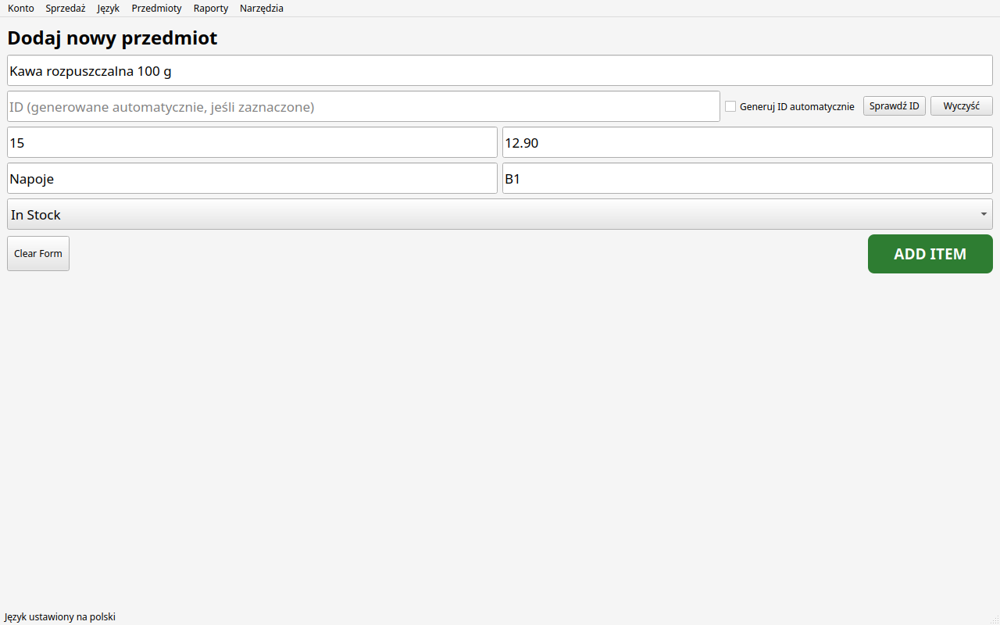

*Rysunek 5‑1: Dodawanie przedmiotu — nazwa, ilość, cena, kategoria i półka.*

### 5.2 Edycja przedmiotu

1. **Przedmioty → Edytuj przedmiot** — strona otwiera się z listą wszystkich przedmiotów.
2. Użyj pola szukania (po nazwie, ID, kategorii, półce lub statusie — wybór pola z listy) lub przewiń listę.
3. Kliknij przedmiot — jego dane wypełnią formularz.
4. Zmień to, co potrzebujesz (nazwa, ilość, cena, kategoria, półka, status).
5. Kliknij **Edytuj przedmiot**.

Zmiana zapisuje się natychmiast i trafia do dziennika pracy.
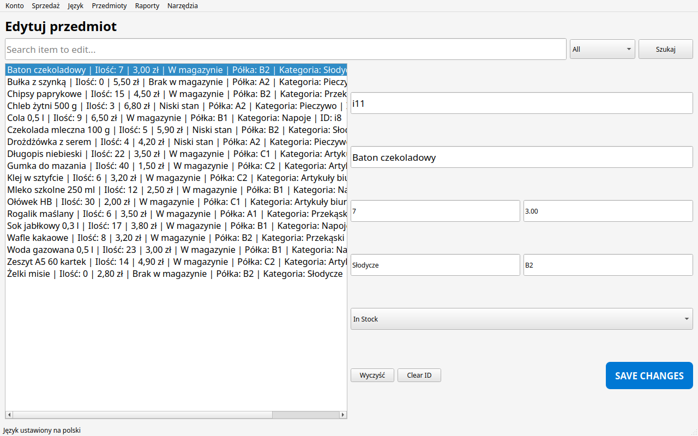

*Rysunek 5‑2: Edycja przedmiotu — wybierz z listy, a potem popraw formularz.*

### 5.3 Usuwanie przedmiotu (soft delete)

1. **Przedmioty → Usuń przedmiot**.
2. Znajdź przedmiot (pole szukania) i kliknij go, aby zaznaczyć.
3. Kliknij **Usuń przedmiot** i potwierdź.

**Ważne:** usuwanie jest „miękkie”. Przedmiot nie jest niszczony — trafia do obszaru „usunięte”, skąd można go przywrócić:

- **Przedmioty → Cofnij usunięte przedmioty** pokazuje wszystkie usunięte produkty.
  - **Cofnij zaznaczone** przywraca podświetlony przedmiot.
  - **Cofnij wszystko** przywraca wszystkie.
  - Przycisk **Cofnij ostatni** na stronie Usuń przywraca ostatnio usunięty przedmiot.
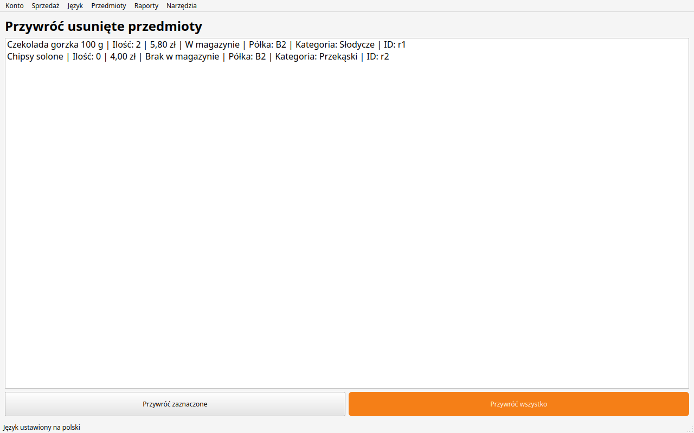

*Rysunek 5‑3: Cofnij usunięte przedmioty — przywracanie „miękkich” usunięć.*

> Usunięcie przedmiotu **nie kasuje** jego dawnych sprzedaży — historia i raporty zachowują zapisy.
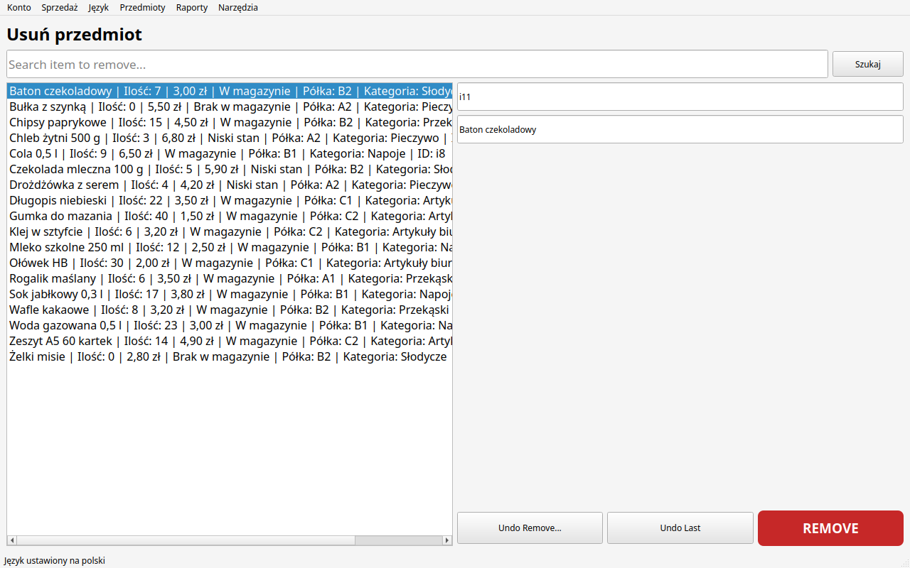

*Rysunek 5‑4: Usuwanie przedmiotu — wybierz go z przefiltrowanej listy i potwierdź.*

### 5.4 Statusy przedmiotów

QMark używa czterech statusów (automatycznych/wybieralnych):

| Status | Znaczenie | Ustawiany automatycznie przy ilości… |
|---|---|---|
| W magazynie | Normalna dostępność | > 5 |
| Niski stan | Kończy się (pomarańczowy) | 1 – 5 |
| Brak w magazynie | Ilość 0 (czerwony) | 0 |
| Wyprzedane | Świadomie wycofany ze sprzedaży (czerwony) | ręcznie |

Statusy aktualizują się również przy sprzedaży, cofaniu sprzedaży oraz zmianie zapasów przez Dostawę.
  

*Rysunek 5‑5: Trzy stany karty w siatce POS.*

---

## Rozdział 6 — Kategorie i półki

### 6.1 Kategorie

**Przedmioty → Zarządzaj kategoriami** — pozwala grupować przedmioty (Przekąski, Napoje, Artykuły biurowe…).

- **Dodaj** — wpisz nazwę kategorii i naciśnij **Dodaj**.
- Zaznacz kategorię na liście → **Edytuj** zmienia jej nazwę.
- Zaznacz → **Usuń** usuwa kategorię (z potwierdzeniem).
- Przyciski **Cofnij dodanie / Cofnij edycję / Cofnij usunięcie** po prostu odświeżają listę.

> Kategorie to tekst wpisywany swobodnie również w formularzach Dodaj/Edytuj przedmiot — utworzenie kategorii tutaj jest wygodne, ale niekonieczne.
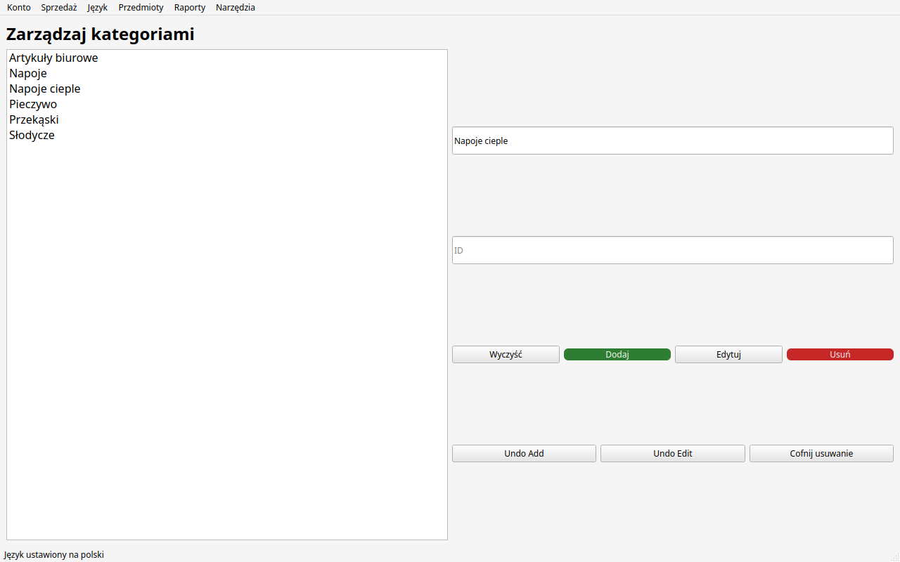

*Rysunek 6‑1: Zarządzanie kategoriami.*

### 6.2 Półki

**Przedmioty → Zarządzaj półkami** działa dokładnie jak kategorie, ale dla lokalizacji fizycznych (`A1`, `B2`, `C3`…). Porządek na półkach pomaga personelowi szybko znajdować produkty i utrzymuje czytelny układ kart POS.
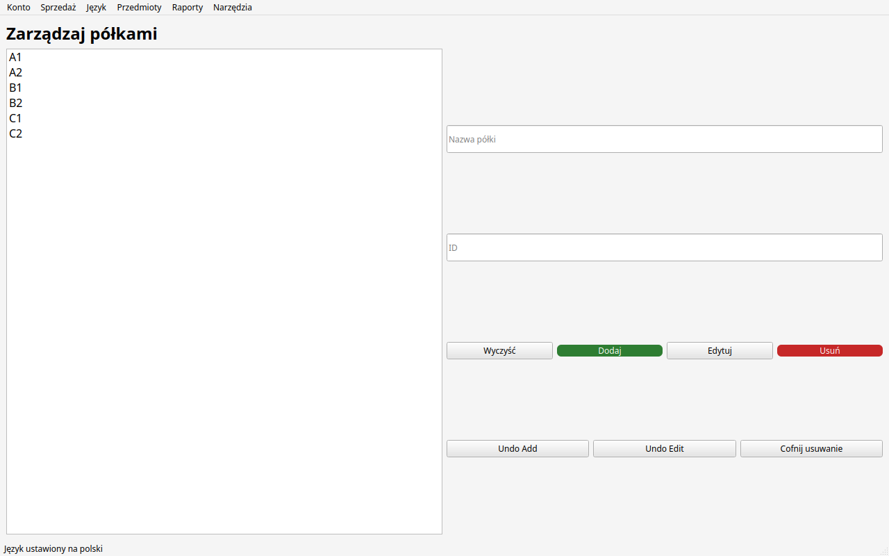

*Rysunek 6‑2: Zarządzanie półkami.*

---

## Rozdział 7 — Dostawa (uzupełnianie zapasów)

**Przedmioty → Dostawa** to najszybszy sposób na poprawienie stanów magazynowych:

1. Wyszukaj przedmiot (wyniki filtrują się podczas pisania).
2. Kliknij przedmiot — jego karta pokaże nazwę, kategorię, półkę, cenę i bieżącą ilość.
3. Zmień ilość za pomocą:
   - dużych przycisków **−10 −5 −1 +1 +5 +10** (zapis natychmiastowy), albo
   - pola liczbowego + przycisku **APPLY** (ustawia dokładną wartość).
4. Etykieta statusu potwierdza każdą zmianę, np. *„Quantity updated to 12!”* (Ilość zaktualizowana na 12).

QMark aktualizuje status przedmiotu automatycznie: `0 → Brak w magazynie`, `≤ 5 → Niski stan`, w przeciwnym razie **W magazynie**. Każda zmiana jest rejestrowana w dzienniku.

> Dostawa przydaje się po dostawie towaru albo gdy zauważysz, że stan na stronie POS jest nieprawidłowy.
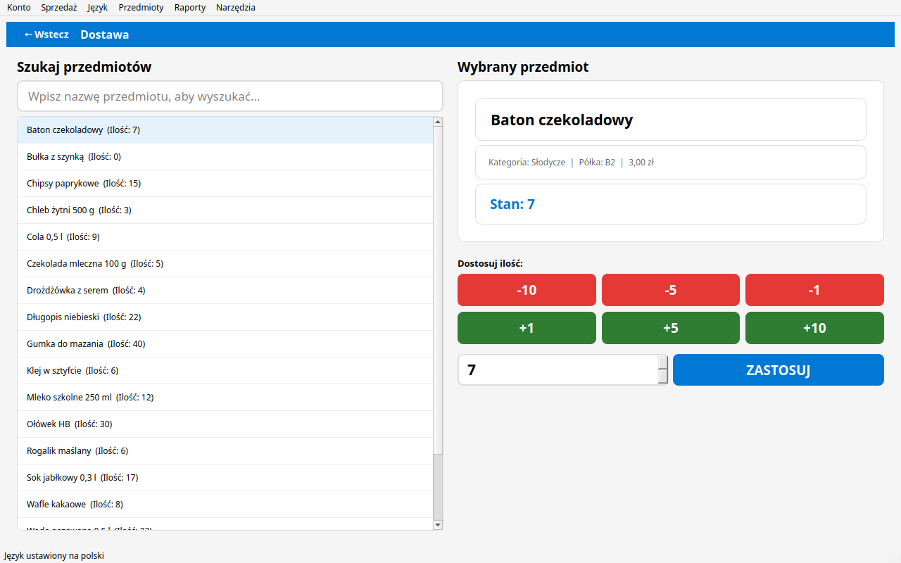

*Rysunek 7‑1: Dostawa — wybierz przedmiot i zmień ilość przyciskami −/+ lub dokładną wartością.*

---

## Rozdział 8 — Historia sprzedaży

**Raporty → Historia sprzedaży** daje pełny dziennik transakcji.

- **Odśwież** przeładowuje wszystkie sprzedaże; u góry widać **Całkowity przychód**.
- **Szukaj** filtruje listę (np. po nazwie przedmiotu lub ID sprzedaży); etykieta zmienia się na **Suma wyszukiwania** dla przefiltrowanych wyników.
- **Widok prosty** przełącza między zwięzłym a szczegółowym formatem linii.
- **Eksport** zapisuje całą listę sprzedaży jako plik **CSV** (`sales_export.csv`, wybierasz lokalizację) z kolumnami:
  `Sale ID, Item ID, Quantity Sold, Unit Price, Total Amount, Sold By, Sale Date`.

> Plik CSV otwiera się bezpośrednio w arkuszach kalkulacyjnych (Excel, LibreOffice Calc) — przydatny do podsumowań dnia lub dla księgowości.
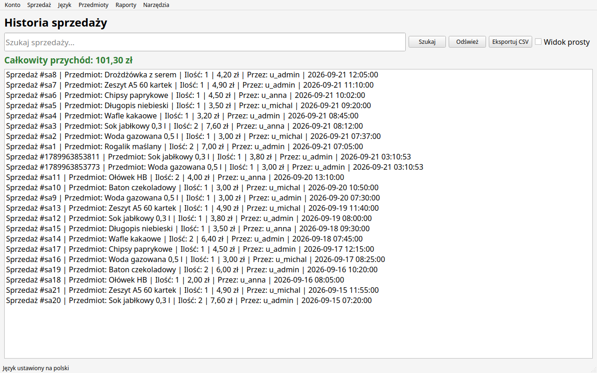

*Rysunek 8‑1: Pełna historia sprzedaży z całkowitym przychodem, szukaniem i eksportem CSV.*

---

## Rozdział 9 — Raporty sprzedaży 📊

**Raporty → Raport sprzedaży** generuje pełny raport na podstawie bieżących danych:

### 9.1 Co zawiera raport

- Podsumowania: przychód, liczba transakcji, sprzedane sztuki.
- Przegląd magazynu: przedmioty w magazynie, liczba przy niskim stanie, liczba braków.
- **Statystyki dzisiejsze**: sprzedaż, przychód, sprzedane sztuki, najlepszy sprzedawca, najlepszy przedmiot, najruchliwsza godzina.
- **Trendy**: przychód z ostatnich 7 dni, trend względem wczoraj.
- **Najlepiej sprzedające się przedmioty** (top 5) i **najlepsi sprzedawcy** (top 3).
- Lista przedmiotów o niskim stanie, które wymagają uzupełnienia.

Automatycznie rysowane są dwa wykresy:

- **Wykres kołowy** — najlepiej sprzedające się przedmioty (top 8 + „Inne”).
- **Wykres słupkowy** — aktywność sklepiku według godzin.

### 9.2 Generowanie i eksport

1. Kliknij **Generuj raport** — pojawią się tekst i wykresy.
2. **Eksport** zapisuje tekst jako `.txt`.
3. **Eksport PDF** zapisuje kompletny dokument PDF zawierający tekst **i** wykresy. Sugerowana nazwa pliku zawiera datę i godzinę (`QMark_Report_2026-09-21_141530.pdf`), dzięki czemu kolejne eksporty nigdy się nie nadpisują.
4. **Wyjdź z raportu** wraca na Pulpit.

> Statystyki są liczone z bazy danych przez niezależny od GUI silnik, więc liczby są poprawne nawet wtedy, gdy kasa była wyłączona podczas przerw.
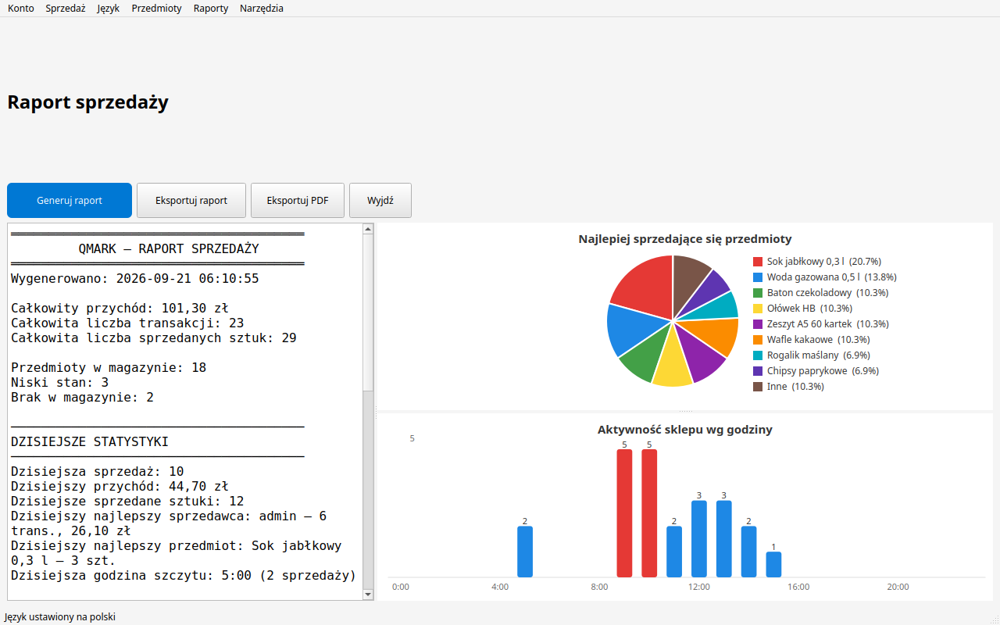

*Rysunek 9‑1: Wygenerowany raport sprzedaży z wykresami kołowym i słupkowym.*

---

## Rozdział 10 — Dziennik pracy

Dziennik pracy rejestruje **co działo się podczas sesji** — każde dodanie, edycję, usunięcie, sprzedaż oraz zmiany kategorii i półek, wraz z nazwiskiem użytkownika.

### 10.1 Włączenie dziennika

**Narzędzia → Ustawienia** → zaznacz **Dziennik pracy (Worklog)** i zapisz. Po włączeniu QMark zapisuje pliki dziennika sesji w folderze `worklogs/` obok programu.

### 10.2 Przeglądanie statystyk

**Narzędzia → Statystyki dziennika** pokazuje liczniki bieżącej sesji:

```
Dodane / edytowane / usunięte przedmioty
Zarejestrowane sprzedaże
Dodane / edytowane / usunięte kategorie
Dodane / edytowane / usunięte półki
Dodani / edytowani / usunięci użytkownicy
```

**Eksport** zapisuje statystyki jako plik tekstowy.
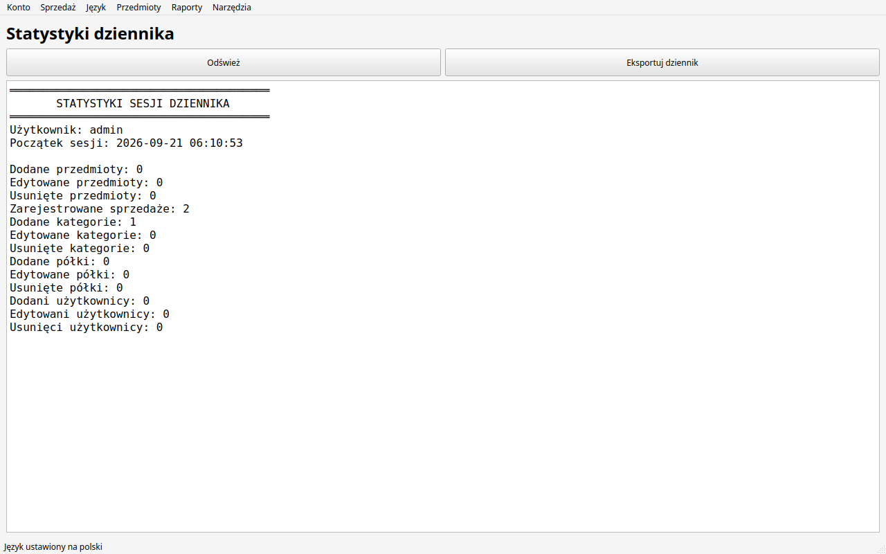

*Rysunek 10‑1: Statystyki dziennika bieżącej sesji.*

---

## Rozdział 11 — Ustawienia 🔒 / ⚙️

**Narzędzia → Ustawienia** (Preferences). Dostępne dla wszystkich zalogowanych użytkowników, ale część opcji jest dostępna tylko dla SuperAdmina.

| Opcja | Kto | Uwagi |
|---|---|---|
| **Język** | wszyscy | Angielski lub polski. |
| **Waluta** | 🔒 SuperAdmin | **PLN (zł)** lub **USD ($)**. ⚠️ Zmiana waluty **nie przelicza** istniejących cen. |
| **Przelicz wszystkie ceny** | 🔒 SuperAdmin | Mnoży wszystkie zapisane ceny przez podany współczynnik (`nowa cena = stara cena × współczynnik`), np. `0,25` przy przejściu ze złotówek na dolary. |
| **Włącz skróty klawiszowe sprzedaży** | wszyscy | Skróty Alt+ na stronie Sprzedaż. |
| **Dziennik pracy** | wszyscy* | Włącza/wyłącza rejestrowanie sesji w dzienniku. |
| **Telemetria** | 🔒 | Patrz rozdział 12.4. |
| **Resetuj ustawienia** | wszyscy* | Przywraca wartości domyślne (język = polski, waluta = PLN, skróty = włączone, dziennik/telemetria = wyłączone). Ścieżki baz danych zostają zachowane. |

> **Zmiana waluty jest kosmetyczna, dopóki nie przeliczysz.** Jeśli przełączysz się z PLN na USD, zmieni się symbol, ale liczby pozostaną te same — użyj **Przelicz wszystkie ceny**, aby faktycznie przeskalować ceny, a potem popraw ręcznie nietypowe przedmioty.
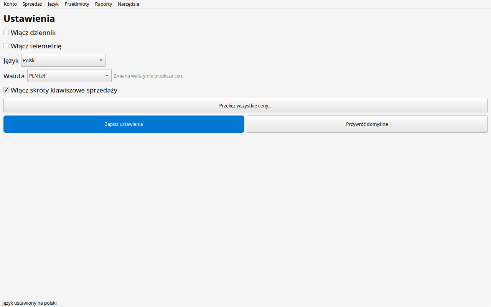

*Rysunek 11‑1: Ustawienia — język, waluta i przełączniki.*

---

## Rozdział 12 — Zarządzanie bazami danych 🔒

### 12.1 Wybór bazy danych

**Narzędzia → Wybór bazy danych** (również **Utwórz bazę danych** prowadzi tutaj).

- **Baza przedmiotów** — ścieżka do `items.db`.
- **Baza użytkowników** — ścieżka do `users.db`.
- **Przeglądaj** — wybór istniejącego pliku `.db` (lub wpisanie ścieżki).
- **Załaduj konfigurację DB** — łączy program z podanymi plikami.
- **Zapisz jako domyślną** — zapamiętuje ścieżki na potrzeby kolejnych uruchomień.
- **Testuj połączenie** — sprawdza, czy program faktycznie sięga do baz.
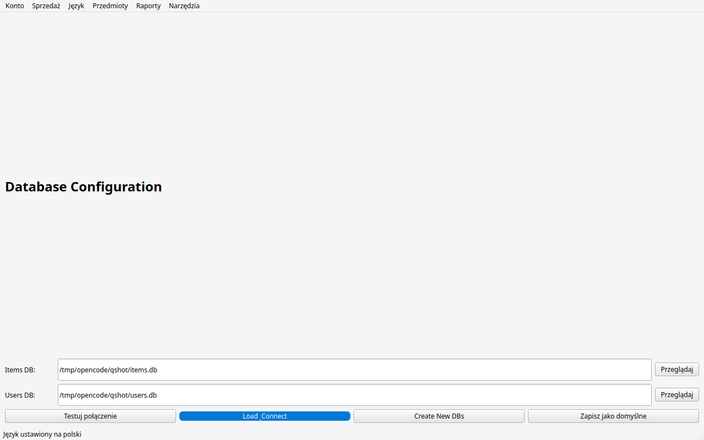

*Rysunek 12‑1: Wybór bazy danych — z jakich plików `items.db` / `users.db` korzysta QMark.*

### 12.2 Tworzenie nowej bazy danych

**Utwórz nową bazę** inicjalizuje świeże bazy SQLite pod podanymi ścieżkami.

⚠️ **To zastępuje to, co znajduje się pod tymi ścieżkami.** Używaj tylko do rozpoczęcia zupełnie nowego sklepiku albo wskaż nowe nazwy plików — nigdy nie wskazuj działających plików `items.db`/`users.db`, chyba że jesteś tego pewien.

### 12.3 Przechowywanie konfiguracji

Poza dwiema bazami QMark zapamiętuje ustawienia (język, waluta, ścieżki baz, przełączniki) w standardowym, per‑użytkownikowym magazynie konfiguracji systemu operacyjnego (`QMark/SchoolShop`).

### 12.4 Telemetria 🔒

Przełącznik **Telemetria** (na stronie Wybór bazy danych) włącza podwójny dziennik:

- czytelny plik `.log` oraz
- bazę SQLite `.db` z tymi samymi zdarzeniami,

przechowywane w folderze `telemetry/` obok programu (pliki `telemetry_<czas>.log` / `.db`). Zdarzenia są rejestrowane do celów diagnostycznych — dane są *lokalne*, opcjonalne i można je wyłączyć w każdej chwili.

> **Notka o prywatności:** telemetria pozostaje na komputerze. Jeśli szkoła ma zasady ochrony danych, trzymaj telemetrię wyłączoną, chyba że potrzebujesz jej do diagnozy — a folder `telemetry/` usuń, gdy logi nie będą już potrzebne.

---

## Rozdział 13 — Rozwiązywanie problemów i diagnostyka

**Narzędzia → Rozwiązywanie problemów** daje trzy narzędzia:

| Przycisk | Funkcja |
|---|---|
| **Testuj połączenie DB** | Sprawdza, czy bazy danych są osiągalne. |
| **Pokaż logi** | Informuje, gdzie przechowywane są pliki logów programu (folder, z którego uruchamiany jest program). |
| **Eksportuj diagnostykę** | Zapisuje plik diagnostyczny z datą (`diagnostics_<czas>.txt`) zawierający: datę, połączenie DB, zalogowanie, użytkownika, rolę, telemetrię wł/wył, dziennik wł/wył, walutę, język. |

**Dobra praktyka:** przed kontaktem ze wsparciem lub zgłoszeniem błędu wyeksportuj diagnostykę oraz odpowiednie pliki logów/telemetrii — zawierają one większość informacji potrzebnych do diagnozy.
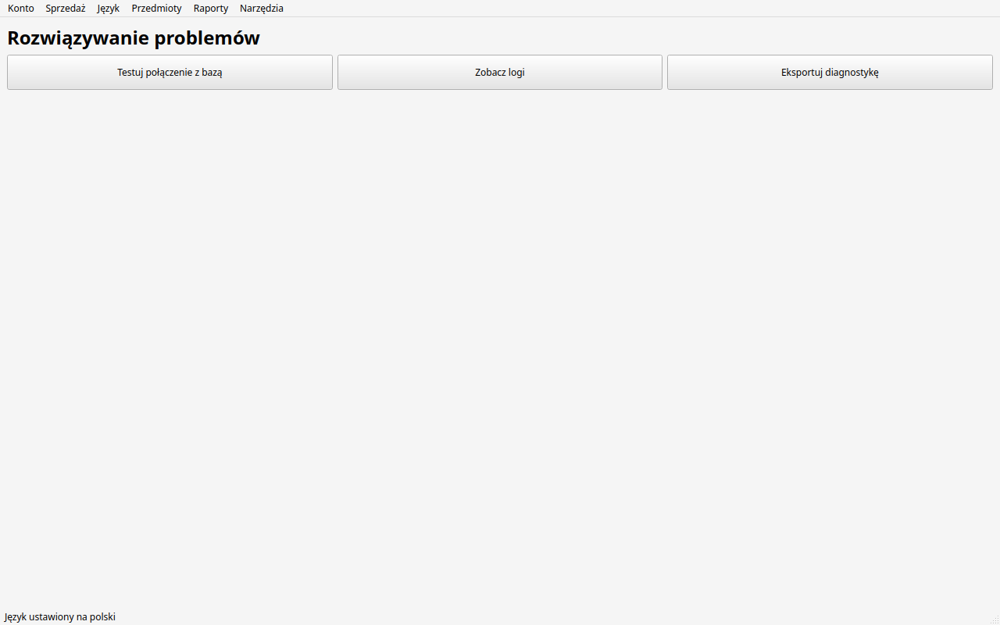

*Rysunek 13‑1: Rozwiązywanie problemów i diagnostyka.*

---

## Rozdział 14 — Automatyzacja i zdalny dostęp 🔒

**Narzędzia → Automatyzacja i zdalny dostęp** to centrum sterowania SuperAdmina. Wszystkie ustawienia zapisuje się przyciskiem **Zapisz ustawienia automatyzacji** (część sekcji zapisuje się też automatycznie przy zmianie). Harmonogram sprawdzany jest co 30 sekund, a zadania wykonują się w skonfigurowanej godzinie — program musi więc działać o zaplanowanym czasie.
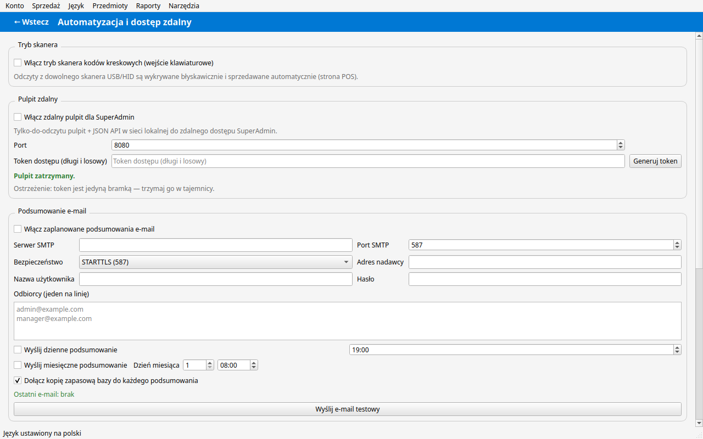

*Rysunek 14‑1: Automatyzacja i zdalny dostęp — wszystkie usługi w jednym miejscu.*

### 14.1 Tryb skanera

**Włącz tryb skanera kodów kreskowych** — włącza automatyczną sprzedaż z czytników USB/HID na stronie POS (patrz Podręcznik użytkownika). Włączasz to raz, a skanery działają dla każdego zalogowanego sprzedawcy.

### 14.2 Zdalny pulpit

**Włącz zdalny pulpit dla SuperAdmina** — udostępnia na *lokalnej sieci* pulpit tylko do odczytu oraz API JSON, dzięki czemu możesz sprawdzać sklepik zdalnie.

1. Zaznacz **Włącz zdalny pulpit dla SuperAdmina**.
2. Ustaw **Port** (domyślnie 8080).
3. Ustaw **Token dostępu** — co najmniej 16 znaków. Przycisk **Generuj token** tworzy długi, losowy token.
4. Zapisz. Etykieta statusu pokazuje stan oraz **URL pulpitu**, zwykle:

   ```
   http://<nazwa-komputera>:8080/?token=<twój-token>
   ```

Otwórz ten adres na innym urządzeniu w tej samej sieci i zaloguj się tokenem.

> 🔐 **Ostrzeżenie bezpieczeństwa:** token jest *jedyną* bramą między siecią a Twoimi danymi. Nigdy go nie udostępniaj, nie używaj krótkiego tokena i włączaj pulpit tylko w zaufanej sieci (szkolny LAN). Program odmówi uruchomienia pulpitu z tokenem krótszym niż 16 znaków.

### 14.3 Podsumowania e-mail

QMark może wysyłać podsumowania sklepiku zgodnie z harmonogramem:

1. **Włącz zaplanowane podsumowania e-mail**.
2. **Ustawienia SMTP**: host (np. `smtp.example.com`), port, tryb zabezpieczeń — `STARTTLS (587)`, `Implicit TLS (465)` lub `Plaintext (25)`; adres nadawcy, nazwa użytkownika, hasło.
3. **Odbiorcy** — jeden adres e-mail w każdym wierszu.
4. Harmonogram:
   - **Wyślij podsumowanie dzienne** o wybranej godzinie (HH:mm).
   - **Wyślij podsumowanie miesięczne** w wybranym dniu miesiąca (1–28) o wybranej godzinie.
5. Opcjonalnie: **Załącz kopię bazy danych do każdego podsumowania** (ZIP z bazami danych).
6. Kliknij **Wyślij testową wiadomość**, aby zweryfikować konfigurację.

Podsumowanie zawiera te same kluczowe liczby co raport (przychód, transakcje, sprzedane sztuki, najlepszy przedmiot, trend).

### 14.4 Kopie zapasowe

Lokalne kopie zapasowe to archiwa ZIP z bazami danych.

- **Folder kopii** — katalog, w którym zapisywane są archiwa.
- **Zachowaj ostatnie N kopii** — ile starych archiwów zachować (domyślnie 10); starsze są usuwane automatycznie.
- **Zaplanowana kopia** — codziennie o wybranej godzinie.
- **Wyślij kopię online e-mailem** — wysyłka do odbiorców skonfigurowanych w 14.3.
- **Prześlij kopię na serwer (HTTP PUT)** — ze wskazaniem adresu URL (można użyć symbolu zastępczego `{filename}`) i opcjonalnym **tokenem Bearer**.
- **Wykonaj kopię teraz** — natychmiastowa kopia, prosto ze strony.

> **Kopie zapasowe to Twoja siatka bezpieczeństwa.** Planuj jedną dziennie, zachowuj co najmniej tydzień historii i trzymaj co najmniej jedną kopię poza tym samym komputerem (e-mail lub przesyłka HTTP).

### 14.5 Automatyczne aktualizacje

- **Włącz automatyczne sprawdzanie aktualizacji na GitHub** — QMark sprawdza nowe wydania przy uruchomieniu.
- **Sprawdź aktualizacje teraz** — sprawdzenie ręczne. Jeśli dostępna jest nowsza wersja, QMark zapyta, czy pobrać i zastosować aktualizację; po jej zastosowaniu program sam się uruchomi ponownie.

> Aktualizuj QMark — każde wydanie zawiera też poprawki i ulepszenia.

---

## Rozdział 15 — Dobre praktyki bezpieczeństwa 🔒

1. **Jeden lub dwóch SuperAdminów.** Cała reszta to Admin lub Sprzedawca.
2. **Używaj silnych haseł.** Co najmniej 8 znaków, wielkie i małe litery, cyfry, znaki specjalne. QMark przechowuje hasła jako **skróty Argon2id z indywidualnymi solami** — ale nawet to nie uratuje słabego hasła.
3. **Token zdalny to też hasło.** Długi, losowy, tajny; wygeneruj nowy po jakichkolwiek podejrzeniach.
4. **Regularnie twórz kopie zapasowe** (14.4) i sprawdzaj, czy da się z nich przywrócić dane.
5. **Znaj swoje dane.** Dwie bazy (`items.db`, `users.db`) to cały sklepik. Opcjonalny folder `telemetry/` zawiera logi diagnostyczne; usuwaj go, gdy nie jest już potrzebny.
6. **Aktualizuj program** (14.5).
7. **Wylogowuj się z pozostawionych bez opieki komputerów** i pilnuj, aby sprzedawcy wylogowywali się po zmianach — każda sprzedaż jest przypisywana zalogowanemu użytkownikowi w raportach i dzienniku.

---

## Rozdział 16 — FAQ (często zadawane pytania)

**P: Zapomniałem hasła SuperAdmina.**
O: Mechanizm odzyskiwania celowo nie istnieje. Przywróć kopię zapasową `users.db` albo (w ostateczności) utwórz świeżą instalację i zarejestruj nowego SuperAdmina.

**P: Czy mogę usunąć konto użytkownika?**
O: W bieżącej wersji nie — przycisk to atrapa. Zamiast tego zmień użytkownikowi hasło.

**P: Symbol waluty się zmienił, a ceny wyglądają źle.**
O: Zmiana waluty nie przelicza cen. Użyj **Przelicz wszystkie ceny** z odpowiednim współczynnikiem, a potem popraw ręcznie przypadki brzegowe.

**P: Zdalny pulpit nie chce się uruchomić.**
O: Token dostępu musi mieć co najmniej 16 znaków. Wygeneruj nowy token, zapisz i sprawdź etykietę statusu; upewnij się też, że port jest wolny.

**P: Podsumowania e-mail nie przychodzą.**
O: Najpierw przetestuj przyciskiem **Wyślij testową wiadomość**. Sprawdź host/port/zabezpieczenia SMTP zgodnie z dostawcą, adres nadawcy oraz to, czy program działa w ustalonej godzinie (harmonogram wymaga uruchomionej kasy).

**P: Gdzie QMark przechowuje dane?**
O: W `items.db` i `users.db` (ścieżki widać na stronie Wybór bazy danych), plus opcjonalne foldery `worklogs/` i `telemetry/` obok programu.

**P: Czy sprzedawcy mogą zmieniać zapasy lub ceny?**
O: Nie — to praca Admina/SuperAdmina (Przedmioty i Dostawa). Sprzedawcy tylko sprzedają, przeglądają dziennik i cofają sprzedaże.

---

## Dodatek — Szybki przewodnik po menu

| Ścieżka | Funkcja | Rola |
|---|---|---|
| Konto → Zarejestruj użytkownika | Utworzenie konta | 🔒 SuperAdmin |
| Przedmioty → Dostawa | Szybka zmiana zapasów | Admin+ |
| Przedmioty → Dodaj/Edytuj/Usuń przedmiot | Magazyn | Admin+ |
| Przedmioty → Cofnij usunięte przedmioty | Przywracanie usuniętych | Admin+ |
| Przedmioty → Zarządzaj kategoriami / półkami | Organizacja sklepiku | Admin+ |
| Sprzedaż → Sprzedaj przedmiot (POS) | Kasa | wszyscy |
| Raporty → Historia sprzedaży | Dziennik transakcji + CSV | Admin+ |
| Raporty → Raport sprzedaży | Tekst + wykresy, eksport TXT/PDF | Admin+ |
| Narzędzia → Wybór bazy danych / Utwórz bazę danych | Ścieżki baz, tworzenie, telemetria | 🔒 SuperAdmin |
| Narzędzia → Konta | Role i hasła | 🔒 SuperAdmin |
| Narzędzia → Ustawienia | Język, waluta, przełączniki | wszyscy (waluta 🔒) |
| Narzędzia → Statystyki dziennika | Statystyki sesji | Admin+ |
| Narzędzia → Rozwiązywanie problemów | Diagnostyka | Admin+ |
| Narzędzia → Automatyzacja i zdalny dostęp | Skaner, pulpit, e-mail, kopie, aktualizacje | 🔒 SuperAdmin |

---

*Dziękujemy za korzystanie z QMark!*