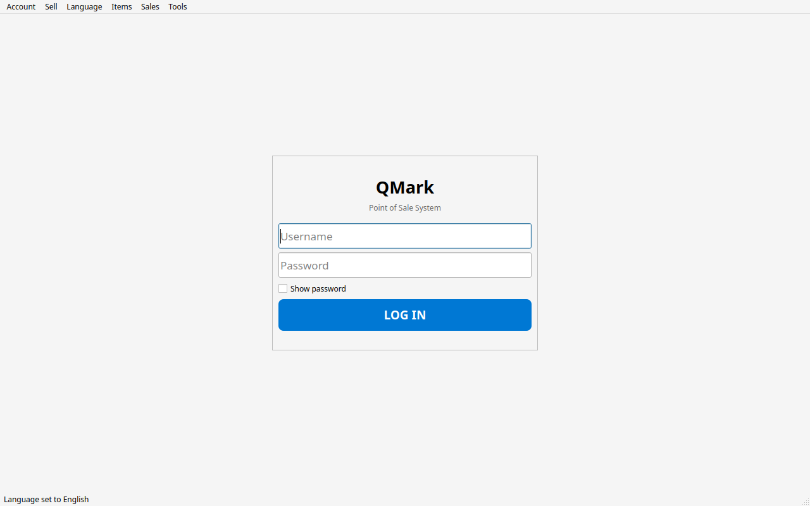
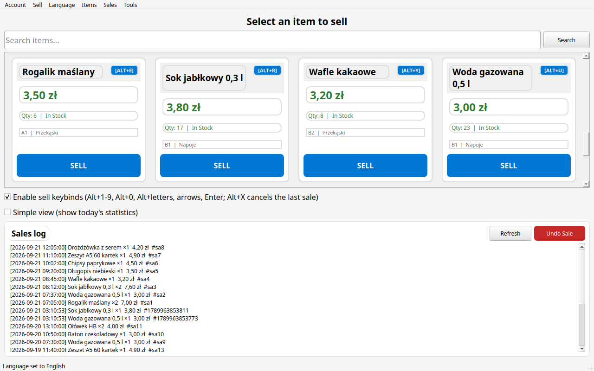
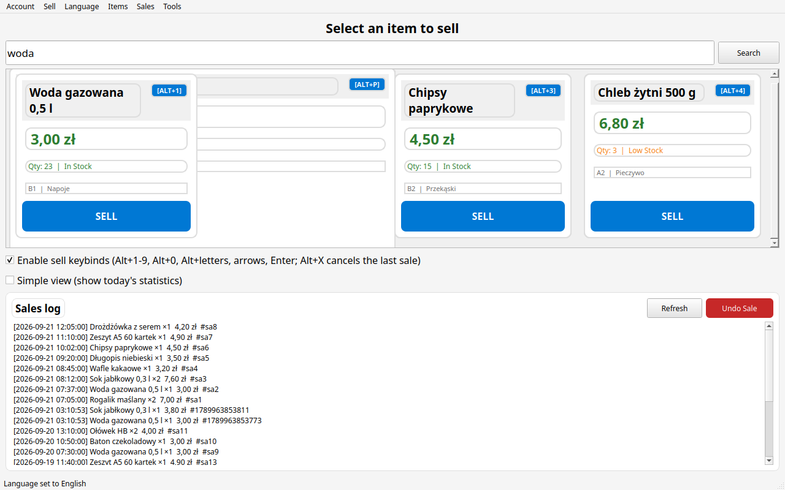
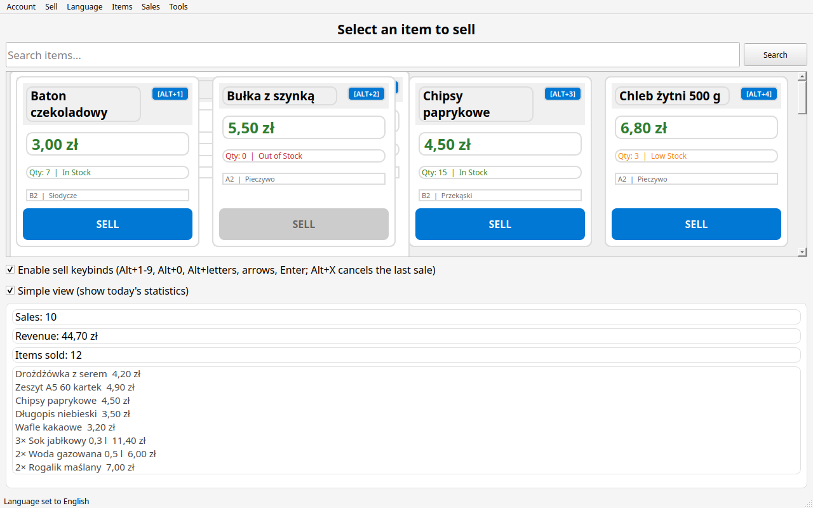

# About This Guide

This guide is written for **till operators** who use QMark every day to sell items in the school shop. It explains only the parts of the program you need for your daily work: logging in, selling items, correcting mistakes, and the everyday screen you work on.

> **Roles in QMark.** The program has three roles: **Clerk** (seller), **Admin**, and **SuperAdmin**. As a Clerk you can *sell items, view the sales log and undo sales*. Everything else (adding items, reports, user accounts, settings) is done by your administrator — if you see an "Access Denied" message, that feature simply is not available to your role.

---

## Chapter 1 — Logging In and Out

### 1.1 Starting QMark

1. Start the program by double‑clicking the `QMark` file (or `QMark.exe` on Windows).
2. The window opens **maximized** — it automatically fits your screen, from 800×600 all the way up to full‑HD monitors.
3. The program remembers its language. The default is Polish; your administrator can change it to English in **Ustawienia** (Settings).

### 1.2 The Login Screen

When QMark starts you see the login screen with the **Username** and **Password** fields.


*Figure 1‑1: The QMark login screen — enter your username and password.*

1. Type your username (as given by your administrator).
2. Type your password.
3. Tick **Show password** if you want to check what you typed.
4. Click **LOG IN**.

> If you type the wrong username or password, QMark shows *"Invalid username or password"* — it never tells you which one was wrong.

### 1.3 After You Log In

As a Clerk you land **directly on the Sell page** (the cash register screen). This is the only page you need.

### 1.4 Changing the Interface Language

The **Language** menu is available to everyone. To switch between English and Polish:

1. Open the menu **Language** (Język).
2. Choose **English** or **Polski**.

The whole interface switches immediately — including menus, buttons and dates.

### 1.5 Logging Out and Exiting

- **Log out** — open the **Account** (Konto) menu and choose **Log Out** (Wyloguj się). The program returns to the login screen so the next operator can start their shift.
- **Exit** — choose **Exit** (Wyjdź) in the same menu to close the program completely.

> **Good practice:** always log out (or lock the screen) when you leave the till, so other people cannot sell items under your name.

---

## Chapter 2 — The Sell Page (Point of Sale)

The Sell page is your main working screen. It consists of three areas:

| Area | What it does |
|---|---|
| **Search box** (top) | Filters the item grid as you type — live. |
| **Item grid** (middle) | Product cards with name, price, stock and a big **SELL** button. |
| **Sales log** (bottom) | The most recent sales of this shop, newest first. |

The grid automatically fits as many cards per row as your screen width allows, so it works just as well on a tablet as on a desktop monitor.


*Figure 2‑1: The Sell page — the till you work on all day.*

### 2.1 Reading an Item Card

Each card shows:

- **Item name** — top‑left.
- **Price** — large, green.
- **Quantity and status** — with a colour code:
  - green — **In Stock**
  - orange — **Low Stock**
  - red — **Out of Stock / Sold Out**
- **Shelf and category** — small grey line (e.g. `A1 | Snacks`).
- **SELL button** — big, touch‑friendly. The button is **disabled (greyed out)** when the item is out of stock or sold out.

> The status colours are there to help you: if a card's quantity line turns orange or red, be careful — the item may not be available much longer.
  

*Figure 2‑2: The three card states — In Stock (green), Low Stock (orange), Out of Stock (red, SELL disabled).*

### 2.2 Searching for Items

Type in the search box and the grid updates instantly while you type. Clear the box to see all items again.

> You do **not** need to press Enter — results appear as you type.


*Figure 2‑3: Typing in the search box filters the grid instantly.*

---

## Chapter 3 — Selling Items

### 3.1 Selling with the SELL button

1. Find the item in the grid (use the search box if needed).
2. Tap the **SELL** button on its card.

That's it — the item is sold, the stock is decreased by one, the sale is written to the sales log, and the grid refreshes automatically. **One click = one unit.**

> **No confirmation pop‑up.** The sale happens immediately — that is intentional, because the till must stay fast. If you make a mistake, undo the sale (Chapter 4).

### 3.2 Selling with the Keyboard (keybinds)

When **Enable sell keybinds** is ticked (it is on by default), you can sell without touching the screen:

| Keys | Action |
|---|---|
| **Alt + 1 … Alt + 9, Alt + 0** | Sell the 1st…10th card in the grid |
| **Alt + letters** (q, w, e, r, t, …) | Sell cards after the first ten, in alphabetical order |
| **← ↑ ↓ →** (arrow keys) | Move the highlighted card |
| **Enter** | Sell the highlighted card |
| **Alt + X** | Cancel/undo the *last* sale (see Chapter 4) |

Each card shows its key‑binding badge (e.g. **Alt+1**) in the top‑right corner.

> The screen letters that are taken by the menus (for example the menu initial letters) are skipped automatically, so the combinations never clash. Gaps in the badges are normal.

### 3.3 When an Item Is Out of Stock

If stock is `0` or the item is marked **Sold Out**, the SELL button is disabled and you cannot sell it. If you try to sell via a keybind or scanner, QMark tells you *"This item is out of stock."* — tell your administrator so they can restock it.

### 3.4 Using a Barcode Scanner

If your shop has a USB/HID barcode scanner and your administrator has turned on **scanner mode**, you can sell simply by scanning:

1. Make sure you are on the Sell page and logged in.
2. Point the scanner at the product's barcode.
3. QMark detects the scan burst (fast keyboard-like input + Enter) and **sells the item automatically**, showing *"Sold via scanner: [item name]"* in the status bar.

The scanned code is matched against the item ID first, then the name. If the code matches nothing, QMark reports *"Scanned code not found"* and nothing is sold.

---

## Chapter 4 — Sales Log and Undoing a Sale

### 4.1 The Sales Log

The sales log at the bottom of the Sell page lists recent sales, newest first, in the form:

```
[2026-09-21 09:15:32] Croissant ×1  3,50 zł  #1729…
```

Each line shows the date and time, the item name and quantity, the total, and the sale number.

- **Refresh** — reloads the list (use it if the screen seems out of date).
- **Simple view** — hides the log and shows today's statistics instead (see 4.3).

### 4.2 Undoing a Sale

Sold the wrong item? No problem:

1. In the sales log, click the sale you want to cancel (it becomes highlighted).
2. Click **Undo Sale**.

If you did **not** select a sale, QMark cancels the **most recent** one.

Undoing a sale:

- restores the item's stock (the quantity increases back);
- updates the item's status (e.g. back from "Out of Stock" to "In Stock");
- removes the sale from the log.

> You can also press **Alt + X** on the Sell page to quickly cancel the last sale.

### 4.3 Simple View — Today's Statistics

Tick **Simple view** to replace the sales log with a compact summary of **today**:

-  **Sales** — number of transactions today,
-  **Revenue** — how much was taken today,
-  **Items sold** — how many units left the shelf today,
-  per‑product lines such as `3× Croissant 10,50 zł` (up to 15 lines).

Untick the box to return to the sales log.


*Figure 4‑1: Simple view — today's statistics instead of the sales log.*

---

## Chapter 5 — Your Daily Workflow: Tips

1. **Log in** at the start of your shift, **log out** at the end.
2. Find items quickly with the **search box** — no scrolling needed.
3. Use **Alt + digits/letters** when there is a queue — it is the fastest way to sell.
4. Keep an eye on the **status colours**; if a product is on its last units, mention it to the administrator.
5. If you sell the wrong item, **undo it immediately** (select it in the log and press **Undo Sale**, or press **Alt + X**).
6. If something looks wrong (a price is missing, an item does not sell), tell your administrator — fixing items, prices and stock is their job.

### What a Clerk cannot do

As a Clerk your menus are limited to **Sell**, **Language** and **Account**. The **Items**, **Sales** and **Tools** menus are not shown to you. If you try to open a restricted feature, QMark shows an **"Access Denied"** message. This is normal — ask your administrator (SuperAdmin) when you need something changed.

---

## Chapter 6 — Quick Reference

### 6.1 Keyboard shortcuts on the Sell page

| Key | Action |
|---|---|
| Alt + 1…9, Alt + 0 | Sell the matching card (first ten) |
| Alt + letters | Sell cards 11+, alphabetical |
| Arrow keys | Move the highlight |
| Enter | Sell highlighted card |
| Alt + X | Undo the last sale |

### 6.2 Glossary

| Term | Meaning |
|---|---|
| **Clerk** | Your role — can sell, view the sales log and undo sales. |
| **Item** | A product you sell (name, quantity, price, category, shelf). |
| **Stock / Quantity** | How many units are left. |
| **Status** | In Stock / Low Stock / Out of Stock / Sold Out. |
| **Category** | A group of items (e.g. Snacks, Drinks). |
| **Shelf** | Where an item physically stands in the shop (e.g. A1, B2). |
| **Sale** | One transaction — one click sells one unit. |
| **POS** | Point of Sale — the Sell page. |

### 6.3 Where to find help

- This guide for everyday operations.
- The **QMark — SuperAdmin Guide** for everything related to setup, accounts, stock and reports — ask your administrator to consult it.
- The built‑in **Troubleshoot** page (Tools menu, admin‑only) can test the database and export diagnostics if a problem ever appears.

---

*Thank you for using QMark!*