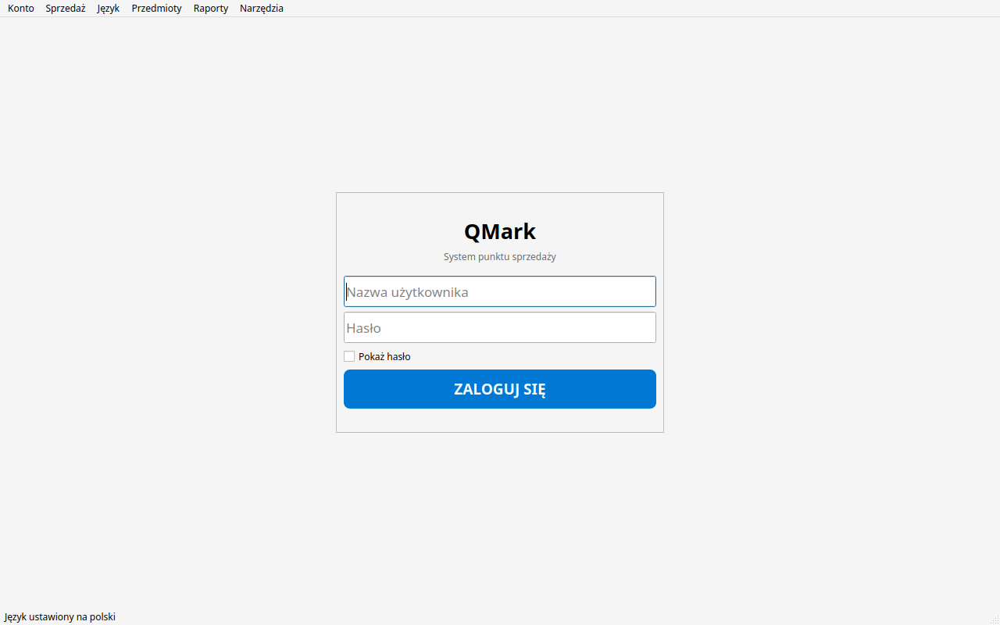
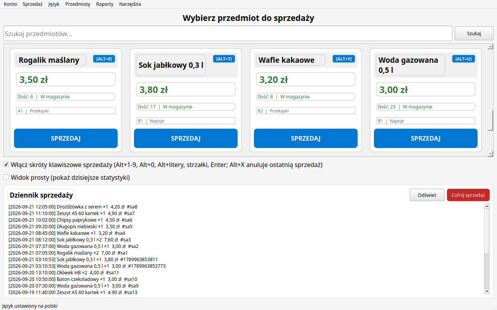
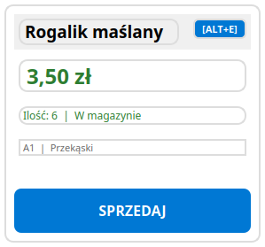
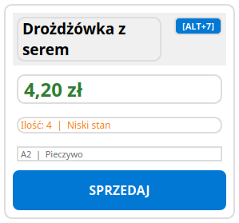
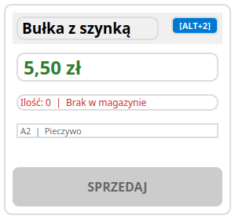
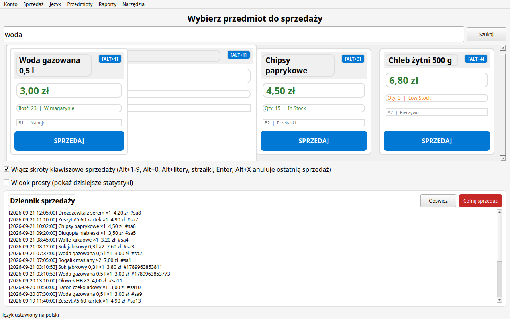
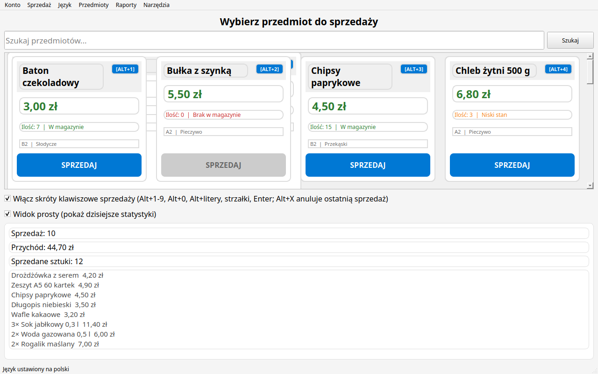

# O tym podręczniku

Ten podręcznik jest przeznaczony dla **sprzedawców**, którzy codziennie obsługują sklepik szkolny za pomocą QMark. Wyjaśnia tylko te części programu, których potrzebujesz w codziennej pracy: logowanie, sprzedaż przedmiotów, poprawianie błędów oraz ekran, na którym pracujesz.

> **Role w QMark.** Program ma trzy role: **Sprzedawca (Clerk)**, **Administrator (Admin)** oraz **SuperAdministrator (SuperAdmin)**. Jako Sprzedawca możesz *sprzedawać przedmioty, przeglądać dziennik sprzedaży i cofać sprzedaże*. Wszystko inne (dodawanie przedmiotów, raporty, konta użytkowników, ustawienia) należy do administratora — jeśli zobaczysz komunikat „Access Denied” (Brak dostępu), oznacza to po prostu, że funkcja nie jest dostępna dla Twojej roli.

---

## Rozdział 1 — Logowanie i wylogowywanie

### 1.1 Uruchamianie QMark

1. Uruchom program, klikając dwukrotnie plik `QMark` (na Windows: `QMark.exe`).
2. Okno otwiera się **zmaksymalizowane** — automatycznie dopasowuje się do ekranu, od 800×600 aż po monitory Full HD.
3. Program pamięta swój język. Domyślnie jest to polski; administrator może zmienić go na angielski w **Ustawieniach**.

### 1.2 Ekran logowania

Po uruchomieniu QMark widzisz ekran logowania z polami **Nazwa użytkownika** i **Hasło**.


*Rysunek 1‑1: Ekran logowania QMark — wprowadź nazwę użytkownika i hasło.*

1. Wpisz swoją nazwę użytkownika (nadane przez administratora).
2. Wpisz hasło.
3. Zaznacz **Pokaż hasło**, jeśli chcesz sprawdzić, co wpisałeś/-aś.
4. Kliknij **ZALOGUJ SIĘ**.

> Jeśli podasz błędną nazwę użytkownika lub hasło, QMark pokaże komunikat *„Invalid username or password”* (Błędna nazwa użytkownika lub hasło) — program celowo nie informuje, które z nich było błędne.

### 1.3 Po zalogowaniu

Jako Sprzedawca trafiasz **bezpośrednio na stronę Sprzedaż (POS)** — ekran kasy. To jedyna strona, której potrzebujesz.

### 1.4 Zmiana języka interfejsu

Menu **Język** jest dostępne dla wszystkich. Aby przełączyć język:

1. Otwórz menu **Język** (Language).
2. Wybierz **Polski** lub **English**.

Cały interfejs przełącza się natychmiast — łącznie z menu, przyciskami i datami.

### 1.5 Wylogowanie i wyjście

- **Wyloguj się** — otwórz menu **Konto** (Account) i wybierz **Wyloguj się** (Log Out). Program wróci do ekranu logowania, aby kolejna osoba mogła rozpocząć swoją zmianę.
- **Wyjdź** — wybierz **Wyjdź** (Exit) w tym samym menu, aby całkowicie zamknąć program.

> **Dobra praktyka:** zawsze wyloguj się (lub zablokuj ekran), gdy odchodzisz od kasy — w ten sposób nikt nie sprzeda przedmiotów „na Twoje konto”.

---

## Rozdział 2 — Strona Sprzedaż (POS)

Strona Sprzedaż to Twój główny ekran pracy. Składa się z trzech obszarów:

| Obszar | Funkcja |
|---|---|
| **Pole szukania** (u góry) | Filtruje siatkę przedmiotów podczas pisania — na żywo. |
| **Siatka przedmiotów** (w środku) | Karty produktów z nazwą, ceną, stanem magazynu i dużym przyciskiem **SPRZEDAJ**. |
| **Dziennik sprzedaży** (na dole) | Najnowsze sprzedaże w sklepiku, od najnowszej. |

Siatka automatycznie dopasowuje liczbę kart w wierszu do szerokości okna, więc działa tak samo dobrze na tablecie, jak na monitorze komputerowym.


*Rysunek 2‑1: Strona Sprzedaż — kasa, na której pracujesz cały dzień.*

### 2.1 Odczyt karty przedmiotu

Każda karta pokazuje:

- **Nazwa przedmiotu** — w lewym górnym rogu.
- **Cena** — duża, zielona.
- **Ilość i status** — z kodem kolorystycznym:
  - zielony — **W magazynie**
  - pomarańczowy — **Niski stan**
  - czerwony — **Brak w magazynie / Wyprzedane**
- **Półka i kategoria** — mała szara linia (np. `A1 | Przekąski`).
- **Przycisk SPRZEDAJ** — duży, przyjazny dla dotyku. Przycisk jest **nieaktywny (wyszarzony)**, gdy przedmiot jest niedostępny lub wyprzedany.

> Kolory statusu informują Cię o stanie zapasów: jeśli linia z ilością zmieni kolor na pomarańczowy lub czerwony, przedmiot może wkrótce zniknąć ze sprzedaży — zgłoś to administratorowi.
  

*Rysunek 2‑2: Trzy stany karty — W magazynie (zielony), Niski stan (pomarańczowy), Brak w magazynie (czerwony, przycisk SPRZEDAJ nieaktywny).*

### 2.2 Szukanie przedmiotów

Wpisz tekst w polu szukania, a siatka zaktualizuje się natychmiast podczas pisania. Wyczyść pole, aby zobaczyć wszystkie przedmioty.

> Nie musisz naciskać Enter — wyniki pojawiają się w trakcie pisania.


*Rysunek 2‑3: Wpisanie tekstu w polu szukania natychmiast filtruje siatkę.*

---

## Rozdział 3 — Sprzedaż przedmiotów

### 3.1 Sprzedaż przyciskiem SPRZEDAJ

1. Znajdź przedmiot w siatce (w razie potrzeby użyj pola szukania).
2. Naciśnij przycisk **SPRZEDAJ** na jego karcie.

To wszystko — przedmiot zostaje sprzedany, stan magazynu zmniejsza się o jeden, sprzedaż trafia do dziennika, a siatka odświeża się automatycznie. **Jedno kliknięcie = jedna sztuka.**

> **Brak okna potwierdzenia.** Sprzedaż następuje natychmiast — to celowe, kasa musi działać szybko. Jeśli popełnisz błąd, cofnij sprzedaż (rozdział 4).

### 3.2 Sprzedaż klawiaturą (skróty klawiszowe)

Gdy zaznaczona jest opcja **Włącz skróty klawiszowe sprzedaży** (domyślnie włączona), możesz sprzedawać bez dotykania ekranu:

| Klawisze | Działanie |
|---|---|
| **Alt + 1 … Alt + 9, Alt + 0** | Sprzedaż 1.…10. karty w siatce |
| **Alt + litery** (q, w, e, r, t, …) | Sprzedaż kolejnych kart, w kolejności alfabetycznej |
| **← ↑ ↓ →** (strzałki) | Przesuwanie podświetlenia |
| **Enter** | Sprzedaż podświetlonej karty |
| **Alt + X** | Anulowanie/cofnięcie *ostatniej* sprzedaży (patrz rozdział 4) |

Każda karta pokazuje swój skrót (np. **Alt+1**) w prawym górnym rogu.

> Litery zajęte przez menu (np. początkowe litery nazw menu) są automatycznie pomijane, więc kombinacje nigdy się nie kolidują. Brakujące plakietki na kartach są normalne.

### 3.3 Gdy przedmiot jest niedostępny

Jeśli stan wynosi `0` lub przedmiot jest oznaczony jako **Wyprzedane**, przycisk SPRZEDAJ jest nieaktywny i nie można go sprzedać. Przy próbie sprzedaży skrótem lub skanerem QMark poinformuje: *„This item is out of stock”* (Przedmiot niedostępny) — zgłoś to administratorowi, aby uzupełnił zapasy.

### 3.4 Używanie skanera kodów kreskowych

Jeśli sklepik ma skaner USB/HID, a administrator włączył **tryb skanera**, sprzedaż odbywa się samym zeskanowaniem:

1. Upewnij się, że jesteś na stronie Sprzedaż i jesteś zalogowany/-a.
2. Skieruj skaner na kod kreskowy produktu.
3. QMark wykrywa serię skanowania (szybkie wpisywanie zakończone Enterem) i **sprzedaje przedmiot automatycznie**, pokazując w pasku stanu komunikat *„Sold via scanner: [nazwa]”* (Sprzedano przez skaner).

Zeskanowany kod jest najpierw dopasowywany do ID przedmiotu, a następnie do nazwy. Jeśli kod nie pasuje do niczego, QMark zgłosi *„Scanned code not found”* (Nie znaleziono zeskanowanego kodu) i nic nie zostanie sprzedane.

---

## Rozdział 4 — Dziennik sprzedaży i cofanie sprzedaży

### 4.1 Dziennik sprzedaży

Dziennik sprzedaży na dole strony Sprzedaż wyświetla ostatnie sprzedaże, od najnowszej, w postaci:

```
[2026-09-21 09:15:32] Rogalik ×1  3,50 zł  #1729…
```

Każda linia pokazuje datę i godzinę, nazwę przedmiotu i ilość, kwotę łączną oraz numer sprzedaży.

- **Odśwież** — przeładowuje listę (użyj, gdy ekran wydaje się nieaktualny).
- **Widok prosty** — ukrywa dziennik i zamiast niego pokazuje dzisiejsze statystyki (patrz 4.3).

### 4.2 Cofanie sprzedaży

Sprzedałeś/-aś zły przedmiot? To nie problem:

1. W dzienniku sprzedaży kliknij sprzedaż, którą chcesz anulować (zostanie podświetlona).
2. Kliknij **Cofnij sprzedaż**.

Jeśli nie zaznaczysz żadnej sprzedaży, QMark anuluje **ostatnią**.

Cofnięcie sprzedaży:

- przywraca stan magazynu przedmiotu (ilość wraca do poprzedniej wartości);
- aktualizuje status przedmiotu (np. z „Brak w magazynie” na „W magazynie”);
- usuwa sprzedaż z dziennika.

> Na stronie Sprzedaż możesz też szybko nacisnąć **Alt + X**, aby cofnąć ostatnią sprzedaż.

### 4.3 Widok prosty — dzisiejsze statystyki

Zaznacz **Widok prosty**, aby zamiast dziennika zobaczyć zwięzłe podsumowanie **dzisiaj**:

- **Sprzedaż** — liczba transakcji dzisiaj,
- **Przychód** — ile zarobiono dzisiaj,
- **Sprzedane sztuki** — ile sztuk zeszło z półek dzisiaj,
- linie per produkt, np. `3× Rogalik 10,50 zł` (do 15 linii).

Odznacz pole, aby wrócić do dziennika sprzedaży.


*Rysunek 4‑1: Widok prosty — dzisiejsze statystyki zamiast dziennika sprzedaży.*

---

## Rozdział 5 — Codzienna praca: wskazówki

1. **Zaloguj się** na początku zmiany, **wyloguj się** na jej końcu.
2. Szukaj przedmiotów szybko przez **pole szukania** — bez przewijania.
3. Przy kolejce używaj **Alt + cyfry/litery** — to najszybszy sposób sprzedaży.
4. Obserwuj **kolory statusu**; jeśli produkt kończy się na półce, wspomnij o tym administratorowi.
5. Jeśli sprzedasz zły przedmiot, **cofnij go od razu** (zaznacz w dzienniku i naciśnij **Cofnij sprzedaż**, lub naciśnij **Alt + X**).
6. Gdy coś wygląda nieprawidłowo (brak ceny, przedmiot nie sprzedaje się), zgłoś to administratorowi — poprawianie przedmiotów, cen i zapasów należy do niego.

### Czego Sprzedawca nie może robić

Jako Sprzedawca masz dostęp tylko do menu **Sprzedaż**, **Język** i **Konto**. Menu **Przedmioty**, **Raporty** i **Narzędzia** nie są dla Ciebie widoczne. Jeśli spróbujesz otworzyć funkcję z ograniczeniami, QMark pokaże komunikat **„Access Denied”** (Brak dostępu). To normalne — gdy potrzebujesz jakiejś zmiany, zwróć się do administratora (SuperAdmina).

---

## Rozdział 6 — Szybka ściąga

### 6.1 Skróty klawiszowe na stronie Sprzedaż

| Klawisz | Działanie |
|---|---|
| Alt + 1…9, Alt + 0 | Sprzedaż odpowiedniej karty (pierwsze dziesięć) |
| Alt + litery | Sprzedaż kart 11+, w kolejności alfabetycznej |
| Strzałki | Przesuwanie podświetlenia |
| Enter | Sprzedaż podświetlonej karty |
| Alt + X | Cofnięcie ostatniej sprzedaży |

### 6.2 Słowniczek

| Termin | Znaczenie |
|---|---|
| **Sprzedawca (Clerk)** | Twoja rola — możesz sprzedawać, przeglądać dziennik i cofać sprzedaże. |
| **Przedmiot** | Produkt w sprzedaży (nazwa, ilość, cena, kategoria, półka). |
| **Zapasy / Ilość** | Ile sztuk zostało. |
| **Status** | W magazynie / Niski stan / Brak w magazynie / Wyprzedane. |
| **Kategoria** | Grupa przedmiotów (np. Przekąski, Napoje). |
| **Półka** | Miejsce fizyczne przedmiotu w sklepiku (np. A1, B2). |
| **Sprzedaż** | Jedna transakcja — jedno kliknięcie sprzedaje jedną sztukę. |
| **POS** | Punkt sprzedaży — strona Sprzedaż. |

### 6.3 Gdzie szukać pomocy

- Ten podręcznik — do codziennej obsługi.
- **QMark — Podręcznik SuperAdmina** — wszystko związane z konfiguracją, kontami, zapasami i raportami; poproś administratora, aby z niego skorzystał.
- Wbudowana strona **Rozwiązywanie problemów** (menu Narzędzia, tylko admin) umożliwia test bazy danych i eksport diagnostyki, gdyby pojawił się problem.

---

*Dziękujemy za korzystanie z QMark!*